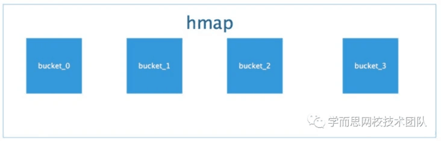
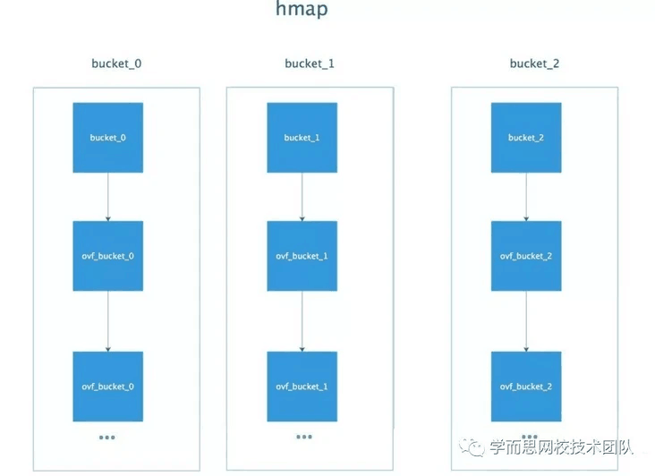
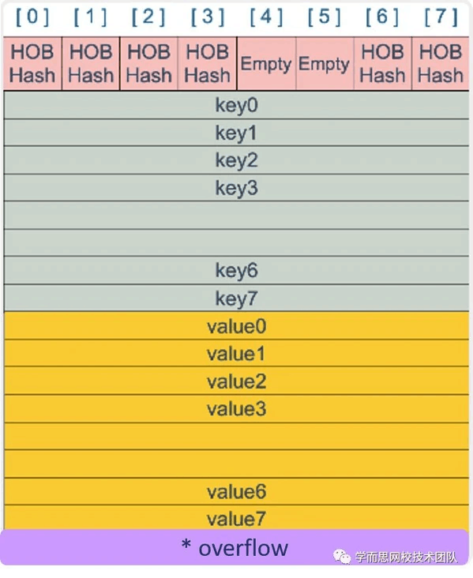
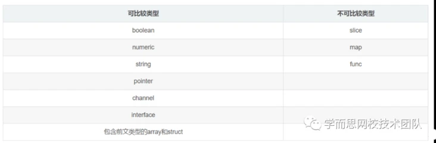
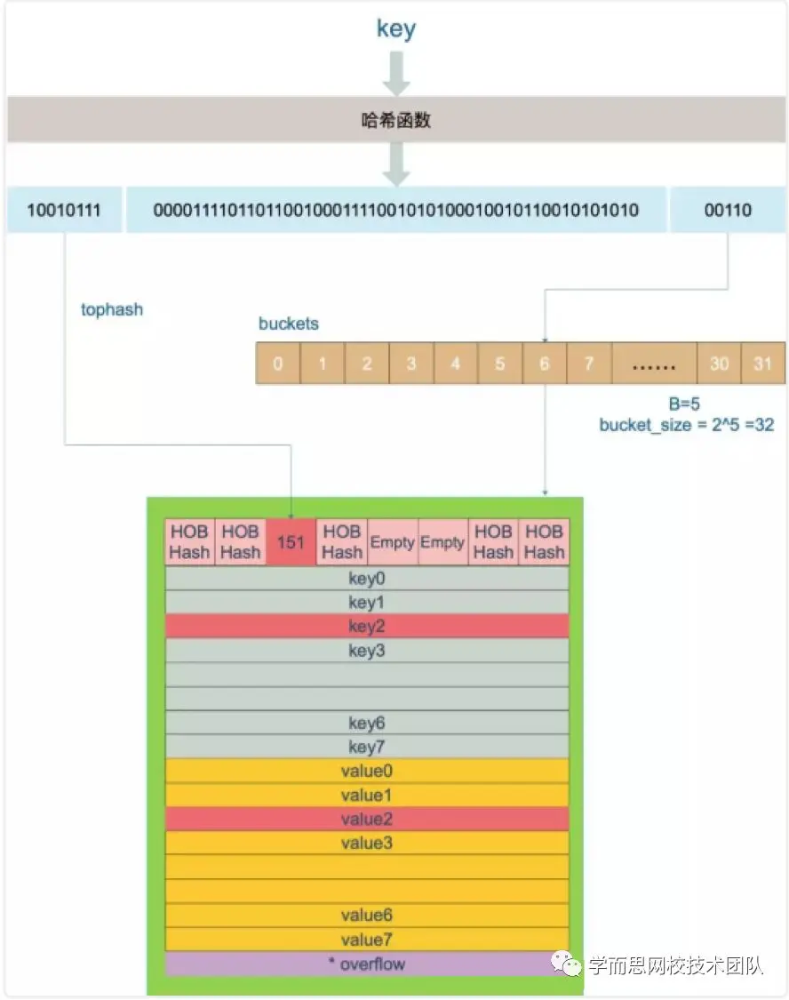
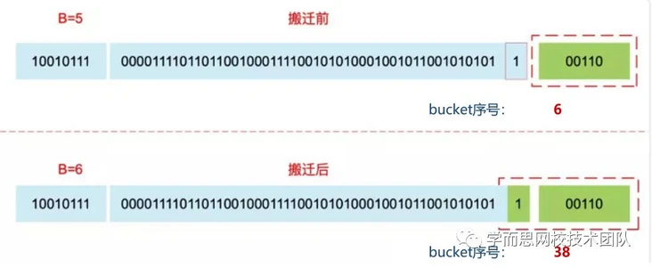

## 1、前言
* golang中map是一个kv对集合。底层使用hash table，用链表来解决冲突 ，出现冲突时，不是每一个key都申请一个结构通过链表串起来，**而是以bmap为最小粒度挂载，一个bmap可以放8个kv**。
* 在哈希函数的选择上，会在程序启动时，检测 cpu 是否支持 aes，如果支持，则使用 aes hash，否则使用 memhash。每个map的底层结构是hmap，是有若干个结构为bmap的bucket组成的数组。每个bucket底层都采用链表结构



## 2、数据结构
#### 2-1 hmap
```
// A header for a Go map.
type hmap struct {
    count     int                  // 元素个数
    flags     uint8                // 并发标志
    B         uint8                // 扩容常量相关字段B是buckets数组的长度的对数 2^B
    noverflow uint16               // 溢出的bucket个数
    hash0     uint32               // hash seed
    buckets    unsafe.Pointer      // buckets 数组指针
    oldbuckets unsafe.Pointer      // 结构扩容的时候用于赋值的buckets数组
    nevacuate  uintptr             // 搬迁进度
    extra *mapextra                // 用于扩容的指针
}

type mapextra struct {
    overflow    *[]*bmap
    oldoverflow *[]*bmap
    nextOverflow *bmap
}
```

#### 2-2 bmap
```
// A bucket for a Go map.
type bmap struct {
    tophash [bucketCnt]uint8        // len为8的数组
}
//底层定义的常量 
const (
    // Maximum number of key/value pairs a bucket can hold.
    bucketCntBits = 3
    bucketCnt     = 1 << bucketCntBits
）
```
* 但这只是表面(src/runtime/hashmap.go)的结构，编译期间会给它加料，动态地创建一个新的结构：
```
type bmap struct {
  topbits  [8]uint8         
  keys     [8]keytype      // 一个bucket装8个kv
  values   [8]valuetype    // 一个bucket装8个kv
  pad      uintptr         // 填充
  overflow uintptr 
}
```

* bmap 就是我们常说的“桶”，桶里面会最多装 8 个 key，这些 key 之所以会落入同一个桶，是因为它们经过哈希计算后，哈希结果是“一类”的，**关于key的定位我们在map的查询和赋值中详细说明。**
* 在桶内，又会根据 key 计算出来的 hash 值的高 8 位来决定 key 到底落入桶内的哪个位置（一个桶内最多有8个位置)。

* 当 map 的 key 和 value 都不是指针，并且 size 都小于 128 字节的情况下，会把 bmap 标记为不含指针，这样可以避免 gc 时扫描整个 hmap。
* 但是，我们看 bmap 其实有一个 overflow 的字段，是指针类型的，破坏了 bmap 不含指针的设想，这时会把 overflow 移动到 hmap的extra 字段来。**这部分我们在分析扩容操作的时候再详细说明**。
#### 2-3 深入分析bmap
* 先看下bmap的内部组成图

* HOBHash 指的就是 top hash，每个bucket中topHash唯一。key 和 value 是各自放在一起的，并不是 key/value/... 这样的形式。可以省略掉 padding 字段，节省内存空间。
>例如，有这样一个类型的 map：map[int64]int8，如果按照 key/value... 这样的模式存储，那在每一个 key/value 对之后都要额外 padding 7 个字节；而将所有的 key，value 分别绑定到一起，这种形式 key/key/.../value/value/...，则只需要在最后添加 padding。
* 每个 bucket 设计成最多只能放 8 个 key-value 对，如果有第 9 个 key-value 落入当前的 bucket，那就需要再构建一个 bucket ，通过 overflow 指针连接起来。

## 3、map初始化
#### 3-1 前言

* 方法1：
```
// 声明变量 --nil map 
// 支持查询 返回类型默认值 
// 赋值、delete操作会panic
var m map[string]string   

// 初始化 --empty map 
// 可以进行赋值操作了
m = make(map[string]string, 10) 
```
* 方法2：
```
m := make(map[string]string,10) // 容量参数可省略
```
* 方法3：
```
m := map[string]string{  // 通过直接赋值进行初始化
    "test": "test",
    "name": "lili",
    "age":  "one",
  }
```
#### 3-2 map初始化源码分析
* 第一步：入参校验，判断key的类型是否合法，必须为可比较类型。



* 第二步：底层调用makemap函数，**计算得到合适的B**(根据用户定义map元素的最大个数)，map容量最多可容纳6.5*2^B个元素，6.5为装载因子阈值常量。
> 装载因子=填入表中的元素个数/散列表的长度，装载因子越大，说明空闲位置越少，冲突越多，散列表的性能会下降。
```
func makemap(t *maptype, hint int, h *hmap) *hmap {
    //边界校验
    if hint < 0 || hint > int(maxSliceCap(t.bucket.size)) {
        hint = 0
    }
    // initialize Hmap
    if h == nil {
        h = new(hmap)
    }
    
    //生成hash种子
    h.hash0 = fastrand()

    // find size parameter which will hold the requested # of elements
    B := uint8(0)

    //计算得到合适的B
    for overLoadFactor(hint, B) {
        B++
    }
    h.B = B

    // allocate initial hash table
    // if B == 0, the buckets field is allocated lazily later (in mapassign)
    // If hint is large zeroing this memory could take a while.
    //申请桶空间  
    if h.B != 0 {
        var nextOverflow *bmap
        h.buckets, nextOverflow = makeBucketArray(t, h.B, nil)
        if nextOverflow != nil {
            h.extra = new(mapextra)
            h.extra.nextOverflow = nextOverflow
        }
    }
    return h
}

//常量loadFactorNum=13 ，loadFactorDen=2
func overLoadFactor(count int, B uint8) bool {
  return count > bucketCnt && uintptr(count) > loadFactorNum*(bucketShift(B)/loadFactorDen)
}
```
* makemap函数会通过 fastrand 创建一个随机的哈希种子，然后根据传入的 hint 计算出需要的最小需要的桶的数量，最后再使用 makeBucketArray创建用于保存桶的数组
>makeBucketArra,这个方法其实就是根据传入的 B 计算出的需要创建的桶数量在内存中分配一片连续的空间用于存储数据，在创建桶的过程中**还会额外创建一些用于保存溢出数据的桶**，数量是 2^(B-4) 个。初始化完成返回hmap指针。

## 4、map查找
#### 4-1 前言

* Go 语言中读取 map 有两种语法：带 comma 和 不带 comma。当要查询的 key 不在 map 里，带 comma 的用法会返回一个 bool 型变量提示 key 是否在 map 中；而不带 comma 的语句则会返回一个 value 类型的零值。如果 value 是 int 型就会返回 0，如果 value 是 string 类型，就会返回空字符串
```
value := m["name"]
fmt.Printf("value:%s", value)

value, ok := m["name"]
  if ok {
    fmt.Printf("value:%s", value)
  }
```
* 两种语法对应到底层**两个不同的函数**，那么在底层是如何定位到key的呢？稍后我们对函数进行源码分析。
```
func mapaccess1(t *maptype, h *hmap, key unsafe.Pointer) unsafe.Pointer
func mapaccess2(t *maptype, h *hmap, key unsafe.Pointer) (unsafe.Pointer, bool)
```
#### 4-2 key的定位
* key 经过哈希计算后得到哈希值，共 64 个 bit 位（64位机，32位机就不讨论了，现在主流都是64位机），计算它到底要落在哪个桶时，只会用到最后 B 个 bit 位。还记得前面提到过的 B 吗？如果 B = 5，那么桶的数量，也就是 buckets 数组的长度是 2^5 = 32。例如，现在有一个 key 经过哈希函数计算后，得到的哈希结果是：
```
10010111 101010101010101010101010101010101010101010101010100 01010
```
* 用最后的 5 个 bit 位，也就是 01010，值为 10，也就是 10 号桶。这个操作实际上就是取余操作，但是取余开销太大，所以代码实现上用的位操作代替。

* **再用哈希值的高 8 位，找到此 key 在 bucket 中的位置，这是在寻找已有的 key。最开始桶内还没有 key，新加入的 key 会找到第一个空位放入。**

* buckets 编号就是桶编号，当两个不同的 key 落在同一个桶中，也就是发生了哈希冲突。冲突的解决手段是用链表法：在 bucket 中，从前往后找到第一个空位
> 这样，在查找某个 key 时，先找到对应的桶，再去遍历 bucket 中的 key。

#### 4-3 key的定位举例分析




* 上图中，假定 B = 5，所以 bucket 总数就是 2^5 = 32。首先计算出待查找 key 的哈希，使用低 5 位 00110，找到对应的 6 号 bucket，使用高 8 位 10010111，对应十进制 151，在 6 号 bucket 中寻找 tophash 值（HOB hash）为 151 的 key
  * 找到了 2 号槽位，这样整个查找过程就结束了。
  * 如果在 bucket 中没找到，并且 overflow 不为空，还要继续去 overflow bucket 中寻找，直到找到或是所有的 key 槽位都找遍了，包括所有的 overflow bucket。

#### 4-4 map查找源码分析
```
func mapaccess1(t *maptype, h *hmap, key unsafe.Pointer) unsafe.Pointer {
    //...
  
    // 如果 h 什么都没有，返回零值
    if h == nil || h.count == 0 {
        return unsafe.Pointer(&zeroVal[0])
    }
  
    // 写和读冲突
    if h.flags&hashWriting != 0 {
        throw("concurrent map read and map write")
    }
    
    // 不同类型 key 使用的 hash 算法在编译期确定
    alg := t.key.alg
    // 计算哈希值，并且加入 hash0 引入随机性
    hash := alg.hash(key, uintptr(h.hash0))
  
    // 比如 B=5，那 m 就是2^5-1，二进制是5个1
    // 求 bucket num 时，将 hash 与 m 按位&操作，
    // 达到 bucket num 由 hash 的低 8 位决定的效果
    m := bucketMask(h.B)
    
    // b 就是 bucket 的地址
    // 基地址+偏移量*size
    b := (*bmap)(add(h.buckets, (hash&m)*uintptr(t.bucketsize)))
  
  
    // oldbuckets 不为 nil，说明发生了扩容
    if c := h.oldbuckets; c != nil {
        // 如果不是同 size 扩容（看后面扩容的内容）
        // 对应条件 1 的解决方案
        if !h.sameSizeGrow() {
            // 新 bucket 数量是老的 2 倍
            m >>= 1
        }

        // 求出 key 在老的 map 中的 bucket 位置
        oldb := (*bmap)(add(c, (hash&m)*uintptr(t.bucketsize)))
        
        // 如果 oldb 没有搬迁到新的 bucket
        // 那就在老的 bucket 中寻找
        if !evacuated(oldb) {
            b = oldb
        }
    }

    // 计算出高 8 位的 hash
    // 相当于右移 56 位，只取高8位
    top := tophash(hash)
  
    //开始寻找key
    for ; b != nil; b = b.overflow(t) {
        // 遍历 8 个 bucket
        for i := uintptr(0); i < bucketCnt; i++ {
            // tophash 不匹配，继续
            if b.tophash[i] != top {
                continue
            }

            // tophash 匹配，定位到 key 的位置
            // 基地址+i*size
            k := add(unsafe.Pointer(b), dataOffset+i*uintptr(t. keysize))

            // key 是指针
            if t.indirectkey {
                // 解引用
                k = *((*unsafe.Pointer)(k))
            }

            // 如果 key 相等
            if alg.equal(key, k) {
            
                // 定位到 value 的位置
                // 桶的结构：kkkkkkkvvvvvvv
                v := add(unsafe.Pointer(b), dataOffset  +bucketCnt*uintptr(t.keysize)+i*uintptr(t.    valuesize))

                // value 解引用
                if t.indirectvalue {
                    v = *((*unsafe.Pointer)(v))
                }
                return v
            }
        }
    }
    return unsafe.Pointer(&zeroVal[0])
}
```
* 这里我们再详细分析下key/value值是如何获取的
```
// key 定位公式
k :=add(unsafe.Pointer(b),dataOffset+i*uintptr(t.keysize))

// value 定位公式
v:= add(unsafe.Pointer(b),dataOffset+bucketCnt*uintptr(t.keysize)+i*uintptr(t.valuesize))

//对于 bmap 起始地址的偏移：（仅仅包含struct.v,即int64）
dataOffset = unsafe.Offsetof(struct{
  b bmap
  v int64
}{}.v)
```
* dataOffset：tophash（8*int8=int64的大小）的偏移量
* bucket 里 key 的起始地址就是 unsafe.Pointer(b)+dataOffset。
* 第 i 个 key 的地址就要在此基础上跨过 i 个 key 的大小。
* 而我们又知道，value 的地址是在所有 key 之后，因此第 i 个 value 的地址还需要加上所有 key 的偏移。

## 5、map赋值
#### 5-1 前言
```
m := make(map[int32]int32)
m[0] = 6666666
```
#### 5-2 map赋值源码分析

* 第一阶段：校验和初始化
```
func mapassign(t *maptype, h *hmap, key unsafe.Pointer) unsafe.Pointer {
    // 判断 hmap 是否已经初始化（是否为 nil）
    if h == nil {
        panic(plainError("assignment to entry in nil map"))
    }
    
    //...
    
    // 判断是否并发读写 map，若是则抛出异常
    if h.flags&hashWriting != 0 {
        throw("concurrent map writes")
    }
    
    // 根据 key 的不同类型调用不同的 hash 方法计算得出 hash 值
    alg := t.key.alg
    hash := alg.hash(key, uintptr(h.hash0))
    
    // 设置 flags 标志位，表示有一个 goroutine 正在写入数据。因为 alg.hash 有可能出现 panic 导致异常
    h.flags |= hashWriting
    
    // 判断 buckets 是否为 nil，若是则调用 newobject 根据当前 bucket 大小进行分配
    // 初始化时没有初始 buckets，那么它在第一次赋值时就会对 buckets 分配
    if h.buckets == nil {
        h.buckets = newobject(t.bucket) // newarray(t.bucket, 1)
    }  

    // 第二阶段

```

* 第二阶段：寻找可插入位和更新既有值
```
    //根据低B位计算得到 bucket 的内存地址
    bucket := hash & bucketMask(h.B)
    
    //判断是否正在扩容，若正在扩容中则先迁移再接着处理
    if h.growing() {
        growWork(t, h, bucket)
    }

    //计算并得到 bucket 的 bmap 指针地址
    b := (*bmap)(unsafe.Pointer(uintptr(h.buckets) + bucket*uintptr(t.bucketsize)))
    
    //计算 key hash 高八位用于查找 Key
    top := tophash(hash)

    var inserti *uint8
    var insertk unsafe.Pointer
    var val unsafe.Pointer

    for {
        
        //迭代 buckets 中的每一个 bucket（共 8 个）
        for i := uintptr(0); i < bucketCnt; i++ {
            
            //对比 bucket.tophash 与 top（高八位）是否一致
            if b.tophash[i] != top {
                
                // 若不一致，判断是否为空槽
                // 有两种情况，第一种是没有插入过。第二种是插入后被删除
                if b.tophash[i] == empty && inserti == nil {
                     
                    // 更新tophash
                    inserti = &b.tophash[i]

                    // 更新可以插入key的地址
                    insertk = add(unsafe.Pointer(b), dataOffset+i*uintptr(t.keysize))
                    
                    // 把该位置标识为可插入 tophash 位置,这里就是第一个可以插入value的地方
                    val = add(unsafe.Pointer(b), dataOffset+bucketCnt*uintptr(t.keysize)+i*uintptr(t.valuesize))
                }
                continue
            }

            //若是匹配（也就是原本已经存在），则进行更新。最后跳出并返回 value 的内存地址
            k := add(unsafe.Pointer(b), dataOffset+i*uintptr(t.keysize))
            
            // 解引用
            if t.indirectkey {
                k = *((*unsafe.Pointer)(k))
            }

            if !alg.equal(key, k) {
                continue
            }
      
            // already have a mapping for key. Update it.
            if t.needkeyupdate {
                typedmemmove(t.key, k, key)
            }
            
            val = add(unsafe.Pointer(b), dataOffset+bucketCnt*uintptr(t.keysize)+i*uintptr(t.valuesize))
            
            goto done
        }
    
        // 继续访问overflow
        // 判断是否迭代完毕，若是则结束迭代 buckets 并更新当前桶位置
        ovf := b.overflow(t)
        if ovf == nil {
        break
        }
        b = ovf
    }

    // 判断是否开始扩容
    // 1、没有正在进行扩容 && 触发最大 LoadFactor 
    // 2、没有正在进行扩容 && 存在过多溢出桶 overflow buckets
    if !h.growing() && (overLoadFactor(h.count+1, h.B) || tooManyOverflowBuckets(h.noverflow, h.B)) {
        
        // 就会进行扩容动作（以确保后续的动作）
        hashGrow(t, h)
        goto again // Growing the table invalidates everything, so try again
    }

    // 第三阶段
```
* 第三阶段：申请新的插入位和插入新值
```
    // 经过前面迭代寻找动作，若没有找到可插入的位置，意味着当前的所有桶都满了
    // 将重新分配一个新溢出桶用于插入动作
    // 最后再在上一步申请的新插入位置，存储键值对，返回该值的内存地址
    if inserti == nil {
        // all current buckets are full, allocate a new one.
        newb := h.newoverflow(t, b)
    
        inserti = &newb.tophash[0]
        insertk = add(unsafe.Pointer(newb), dataOffset)
        val = add(insertk, bucketCnt*uintptr(t.keysize))
    }

    // store new key/value at insert position
    if t.indirectkey {
        kmem := newobject(t.key)
        *(*unsafe.Pointer)(insertk) = kmem
        insertk = kmem
    }
    if t.indirectvalue {
        vmem := newobject(t.elem)
        *(*unsafe.Pointer)(val) = vmem
    }
  
    typedmemmove(t.key, insertk, key)
    *inserti = top
    h.count++
    done
    
    ...

    // 返回插入新值value在桶中的地址
    return val
}

// 第四阶段
```
* 第四阶段：写入
  * 最后返回的是内存地址。是怎么进行写入的呢？这是因为隐藏的最后一步写入动作（将值拷贝到指定内存区域）是通过底层汇编配合来完成的，在 runtime 中只完成了绝大部分的动作。
  *  mapassign 函数和拿到值存放的内存地址，再将 6666666 这个值存放进该内存地址中。另外我们看到 PCDATA 指令，主要是包含一些垃圾回收的信息，由编译器产生。

## 6 扩容
#### 6-1 tophash的不同用处
* 关于上文中一直提到的扩容是怎么回事呢，现在我们来具体分析下。
* 还记得bucket中的topHash字段吗？现在我们来补充知识点minTopHash：   
  * 当一个 cell 的 tophash 值小于 minTopHash 时，标志这个 cell 的迁移状态。因为这个状态值是放在 tophash 数组里，为了和正常的哈希值区分开，会给 key 计算出来的哈希值一个增量：minTopHash。这样就能区分**正常的 tophash 值**和**表示状态**的哈希值。

* 下面的这几种状态就表征了 bucket 的情况：
```
// 空的 cell，也是初始时 bucket 的状态
empty  = 0

// 空的 cell，表示 cell 已经被迁移到新的 bucket
evacuatedEmpty = 1

// key,value 已经搬迁完毕，但是 key 都在新 bucket 前半部分，
evacuatedX  = 2

// 同上，key 在后半部分
evacuatedY  = 3

// tophash 的最小正常值
minTopHash  = 4
```
* 为了避免计算出的topHash与minTopHash 冲突，底层做了相关操作：
```
func tophash(hash uintptr) uint8 {
    top := uint8(hash >> (sys.PtrSize*8 - 8))
    
    // 我确确实实计算出来就是小了
    if top < minTopHash {
        top += minTopHash
    }
    return top
}
```
#### 6-2 装载因子

* 随着向 map 中添加的 key 越来越多，key 发生碰撞的概率也越来越大。bucket 中的 8 个 cell 会被逐渐塞满，查找、插入、删除 key 的效率也会越来越低。**最理想的情况是一个 bucket 只装一个 key，这样，就能达到 O(1) 的效率**，但这样空间消耗太大，用空间换时间的代价太高。（**因为桶太多了，桶struct又很大）**。
* Go 语言采用一个 bucket 里装载 8 个 key，**定位到某个 bucket 后，还需要再定位到具体的 key**，这实际上又用了时间换空间。当然，这样做，**要有一个度**，不然所有的 key 都落在了同一个 bucket 里，**直接退化成了链表**，各种操作的效率直接降为 O(n)，是不行的。因此，需要有一个指标来衡量前面描述的情况，这就是装载因子。

* Go 源码里这样定义: loadFactor := count/(2^B)
    * count 就是 map 的元素个数，2^B 表示 bucket 数量。

#### 6-3 触发 map 扩容的时机
* 在向 map 插入新 key 的时候，会进行条件检测，符合下面这 2 个条件，就会触发扩容：
    * 1、装载因子超过阈值，源码里定义的阈值是 6.5
    * 2、overflow 的 bucket 数量过多

```
//触发扩容的时机
if !h.growing() && (overLoadFactor(h.count+1, h.B) || tooManyOverflowBuckets(h.noverflow, h.B)) {
    hashGrow(t, h)
    goto again // Growing the table invalidates everything, so try again
}

// 装载因子超过 6.5
func overLoadFactor(count int, B uint8) bool {
    return count > bucketCnt && uintptr(count) > loadFactorNum*(bucketShift(B)/loadFactorDen)
}

// overflow buckets 太多
func tooManyOverflowBuckets(noverflow uint16, B uint8) bool {
    if B > 15 {
        B = 15
    }
    return noverflow >= uint16(1)<<(B&15)
}
```

#### 6-4 扩容的两种策略
##### 6-4-1 原因分析
* 第 1 点，**overLoadFactor**：我们知道，每个 bucket 有 8 个空位，在没有溢出，且所有的桶都装满了的情况下，装载因子算出来的结果是 8。因此当装载因子超过 6.5 时，表明很多 bucket 都快要装满了，查找效率和插入效率都变低了。在这个时候进行扩容是有必要的。

* 第 2 点，**tooManyOverflowBuckets**：是对第 1 点的补充。**就是说在装载因子比较小的情况下，这时候 map 的查找和插入效率也很低，而第 1 点识别不出来这种情况**。表面现象就是计算装载因子的分子比较小，即 map 里元素总数少，但是 bucket 数量多（真实分配的 bucket 数量多，包括大量的 overflow bucket）。
  * 不难想像造成这种情况的原因：不停地插入、删除元素。先插入很多元素，导致创建了很多 bucket，但是装载因子达不到第 1 点的临界值，未触发扩容来缓解这种情况。之后，删除元素降低元素总数量，再插入很多元素，导致创建很多的 overflow bucket，但就是不会触犯第 1 点的规定，你能拿我怎么办？overflow bucket 数量太多，导致 key 会很分散，查找插入效率低得吓人，因此出台第 2 点规定。这就像是一座空城，房子很多，但是住户很少，都分散了，找起人来很困难。

##### 6-4-2 扩容策略
* 对于条件 1，元素太多，而 bucket 数量太少，很简单：将 B 加 1，bucket 最大数量(2^B)直接变成原来 bucket 数量的 2 倍。于是，就有新老 bucket 了。
>注意，这时候元素都在老 bucket 里，还没迁移到新的 bucket 来。新 bucket 只是最大数量变为原来最大数量的 2 倍(2^B*2) 。

* 对于条件 2，其实元素没那么多，但是 overflow bucket 数特别多，说明很多 bucket 都没装满。解决办法就是开辟一个新 bucket 空间，将老 bucket 中的元素移动到新 bucket，使得同一个 bucket 中的 key 排列地更紧密。这样，原来，在 overflow bucket 中的 key 可以移动到 bucket 中来。结果是节省空间，提高 bucket 利用率，map 的查找和插入效率自然就会提升。**(即通过迁移的方式，回收益处块)**

#### 6-5 扩容源码分析
* 由于 map 扩容需要将原有的 key/value 重新搬迁到新的内存地址，如果有大量的 key/value 需要搬迁，会非常影响性能。因此 Go map 的扩容采取了一种称为 **“渐进式”** 的方式，原有的 key 并不会一次性搬迁完毕，每次**最多只会搬迁 2 个 bucket**。

* 上面说的 hashGrow() 函数实际上并没有真正地“搬迁”，它只是分配好了新的 buckets，并将老的 buckets 挂到了 oldbuckets 字段上。
* 真正搬迁 buckets 的动作在 growWork() 函数中，而调用 growWork() 函数的动作是在 mapassign 和 mapdelete 函数中。**（增量扩容）**
>也就是插入或修改、删除 key 的时候，都会尝试进行搬迁 buckets 的工作。先检查 oldbuckets 是否搬迁完毕，具体来说就是检查 oldbuckets 是否为 nil。
```
func hashGrow(t *maptype, h *hmap) {
    // B+1 相当于是原来 2 倍的空间
    // 增量
    bigger := uint8(1)
  
    // 对应条件 2
    if !overLoadFactor(h.count+1, h.B) {
        // 进行等量的内存扩容，所以 B 不变
        bigger = 0
        h.flags |= sameSizeGrow
    }
    // 将老 buckets 挂到 buckets 上
    oldbuckets := h.buckets
  
    // 申请新的 buckets 空间
    newbuckets, nextOverflow := makeBucketArray(t, h.B+bigger, nil)
    
    
    // 先把 h.flags 中 iterator 和 oldIterator 对应位清 0
    flags := h.flags &^ (iterator | oldIterator)
    
    // 如果 iterator 位为 1，把它转接到 oldIterator 位，使得 oldIterator 标志位变成1
    if h.flags&iterator != 0 {

        // 可以理解为buckets 现在挂到了 oldBuckets 名下了，将对应的标志位也转接过去
        flags |= oldIterator
    }
    
    // 原子操作
    // commit the grow (atomic wrt gc)
    h.B += bigger
    h.flags = flags
    h.oldbuckets = oldbuckets
    h.buckets = newbuckets

    // 搬迁进度为 0
    h.nevacuate = 0

    // overflow buckets 数为 0
    h.noverflow = 0
}
```
* 这里注意到这段代码：` newbuckets, nextOverflow := makeBucketArray(t, h.B+bigger, nil)`。第一反应是扩容的时候就马上申请并初始化内存了吗？假设涉及大量的内存分配，那挺耗费性能的...然而并不，内部只会先进行预分配，当使用的时候才会真正的去初始化。
* 几个标志位如下：
```
// 可能有迭代器使用 buckets
iterator = 1

// 可能有迭代器使用 oldbuckets
oldIterator = 2

// 有协程正在向 map 中写入 key
hashWriting = 4

// 等量扩容（对应条件 2）
sameSizeGrow = 8
```
* 再来看看真正执行搬迁工作的 growWork() 函数
```
func growWork(t *maptype, h *hmap, bucket uintptr) {
    
    // 搬迁正在使用的旧 bucket
    evacuate(t, h, bucket&h.oldbucketmask())
    
    // 再搬迁一个 bucket，以加快搬迁进程
    if h.growing() {
        evacuate(t, h, h.nevacuate)
    }
}

func (h *hmap) growing() bool {
  return h.oldbuckets != nil
}
```
* 在该方法中，主要是两个 evacuate 函数的调用。他们在调用上又分别有什么区别呢？如下：
    * evacuate(t, h, bucket&h.oldbucketmask()): 将 oldbucket 中的元素迁移 rehash 到扩容后的新 bucket
    * evacuate(t, h, h.nevacuate): 如果当前正在进行扩容，则再进行多一次迁移
* 另外，在执行扩容动作的时候，可以发现都是以 bucket/oldbucket 为单位的，而不是传统的 buckets/oldbuckets。再结合代码分析，可得知在 Go map 中扩容是采取增量扩容的方式，并非一步到位
* 为什么是增量扩容？
    * 如果是全量扩容的话，那问题就来了。假设当前 hmap 的容量比较大，直接全量扩容的话，就会导致扩容要花费大量的时间和内存，导致系统卡顿，最直观的表现就是慢。显然，不能这么做
    * 而增量扩容，就可以解决这个问题。它通过每一次的 map 操作行为去分摊总的一次性动作。因此有了 buckets/oldbuckets 的设计，它是逐步完成的，并且会在扩容完毕后才进行清空
* 搬迁过程evacuate源码：
```
type evacDst struct {
  b *bmap          // 表示bucket 移动的目标地址
  i int            // 指向 x,y 中 key/val 的 index
  k unsafe.Pointer // 指向 x，y 中的 key
  v unsafe.Pointer // 指向 x，y 中的 value
}

// 帮助理解源码
// x:等 size 扩容
// y:非等 size 扩容

func evacuate(t *maptype, h *hmap, oldbucket uintptr) {
    // 定位老的 bucket 地址
    b := (*bmap)(add(h.oldbuckets, oldbucket*uintptr(t.bucketsize)))
  
    // 计算容量 结果是 2^B，如 B = 5，结果为32
    newbit := h.noldbuckets()
  
    // 如果 b 没有被搬迁过
    if !evacuated(b) {
        // 默认是等 size 扩容，前后 bucket 序号不变
        var xy [2]evacDst
        
        // 使用 x 来进行搬迁
        x := &xy[0]
    
        // oldbucket：标识旧的桶的序号
        x.b = (*bmap)(add(h.buckets, oldbucket*uintptr(t.bucketsize)))
        x.k = add(unsafe.Pointer(x.b), dataOffset)
        x.v = add(x.k, bucketCnt*uintptr(t.keysize))

        // 如果不是等 size 扩容，前后 bucket 序号有变
        if !h.sameSizeGrow() {
            // 使用 y 来进行搬迁
            y := &xy[1]
            
            // y 代表的 bucket 序号增加了 2^B
            y.b = (*bmap)(add(h.buckets, (oldbucket+newbit)*uintptr(t.bucketsize)))
            y.k = add(unsafe.Pointer(y.b), dataOffset)
            y.v = add(y.k, bucketCnt*uintptr(t.keysize))
        }
    
        // 遍历所有的 bucket，包括 overflow buckets 
        // b 是老的 bucket 地址
        for ; b != nil; b = b.overflow(t) {
            k := add(unsafe.Pointer(b), dataOffset)
            v := add(k, bucketCnt*uintptr(t.keysize))
            
            // 遍历 bucket 中的所有 cell
            for i := 0; i < bucketCnt; i, k, v = i+1, add(k, uintptr(t.keysize)), add(v, uintptr(t.valuesize)) {
                
                // 当前 cell 的 top hash 值
                top := b.tophash[i]
                
                // 如果 cell 为空，即没有 key
                if top == empty {
                    // 那就标志它被"搬迁"过
                    b.tophash[i] = evacuatedEmpty
                    continue
                }
        
                // 正常不会出现这种情况
                // 未被搬迁的 cell 只可能是 empty 或是
                // 正常的 top hash（大于 minTopHash）
                if top < minTopHash {
                    throw("bad map state")
                }
        
                // 如果 key 是指针，则解引用
                k2 := k
                if t.indirectkey {
                    k2 = *((*unsafe.Pointer)(k2))
                }
                
                var useY uint8
                // 如果不是等量扩容
                if !h.sameSizeGrow() {
                    // 计算 hash 值，和 key 第一次写入时一样
                    hash := t.key.alg.hash(k2, uintptr(h.hash0))
          
                    // 如果有协程正在遍历 map 如果出现 相同的 key 值，算出来的 hash 值不同
                    if h.flags&iterator != 0 && !t.reflexivekey && !t.key.alg.equal(k2, k2) {
                        // useY =1 使用位置Y
                        useY = top & 1
                        top = tophash(hash)
                    } else {
                        // 第 B 位置 不是 0
                        if hash&newbit != 0 {
                            //使用位置Y
                            useY = 1
                        }
                    }
                }

                if evacuatedX+1 != evacuatedY {
                    throw("bad evacuatedN")
                }
                
                //决定key是裂变到 X 还是 Y
                b.tophash[i] = evacuatedX + useY // evacuatedX + 1 ==   evacuatedY
                dst := &xy[useY]                 // evacuation destination
                
                // 如果 xi 等于 8，说明要溢出了
                if dst.i == bucketCnt {
                    // 新建一个 bucket
                    dst.b = h.newoverflow(t, dst.b)
                    
                    // xi 从 0 开始计数
                    dst.i = 0
                    
                    //key移动的位置
                    st.k = add(unsafe.Pointer(dst.b), dataOffset)
                    //value 移动的位置
                    dst.v = add(dst.k, bucketCnt*uintptr(t.keysize))
                }
                
                // 设置 top hash 值
                dst.b.tophash[dst.i&(bucketCnt-1)] = top // mask dst.i as an optimization, to avoid a bounds check
                
                // key 是指针
                if t.indirectkey {
                    // 将原 key（是指针）复制到新位置
                    *(*unsafe.Pointer)(dst.k) = k2 // copy pointer
                } else {
                    // 将原 key（是值）复制到新位置
                    typedmemmove(t.key, dst.k, k) // copy value
                }
        
                //value同上
                if t.indirectvalue {
                    *(*unsafe.Pointer)(dst.v) = *(*unsafe.Pointer)(v)
                } else {
                    typedmemmove(t.elem, dst.v, v)
                }
                
                // 定位到下一个 cell
                dst.i++
                dst.k = add(dst.k, uintptr(t.keysize))
                dst.v = add(dst.v, uintptr(t.valuesize))
            }
        }
        // Unlink the overflow buckets & clear key/value to help GC.
        // bucket搬迁完毕 如果没有协程在使用老的 buckets，就把老 buckets 清除掉，帮助gc
        if h.flags&oldIterator == 0 && t.bucket.kind&kindNoPointers == 0 {
            b := add(h.oldbuckets, oldbucket*uintptr(t.bucketsize))
            ptr := add(b, dataOffset)
            n := uintptr(t.bucketsize) - dataOffset
            memclrHasPointers(ptr, n)
        }
    }
    // 更新搬迁进度
    f oldbucket == h.nevacuate {
        advanceEvacuationMark(h, t, newbit)
    }
}
```
* 扩容后，B 增加了 1，意味着 buckets 总数是原来的 2 倍，原来 1 号的桶“裂变”到两个桶，某个 key 在搬迁前后 bucket 序号可能和原来相等，也可能是相比原来加上 2^B（原来的 B 值），取决于 hash 值 第 6 bit 位是 0 还是 1。原理看下图：



## 7、map遍历：
#### 7-1 前言
```
    // 1.只获取key
    for key := range m {
        fmt.Println(key)
    }

    // 2.只获取value
    for _, value := range m {
        fmt.Println(value)
    }

    // 3.有序遍历map，获取kv
    keys := []string{}
    for k, _ := range m {
        keys = append(keys, k)
    }
    sort.Strings(keys) // 排序
    for _, k := range keys { // 有序遍历
        fmt.Println(k, m[k])
    }
```
* 理解了上面 bucket 序号的变化，我们就可以回答另一个问题了：为什么遍历 map 是无序的？
#### 7-2 遍历的底层实现
* for range map 在编译器展开后的伪实现
```
var hiter map_iteration_struct
for mapiterinit(type, range, &hiter); hiter.key != nil; mapiternext(&hiter) {
    index_temp = *hiter.key
    value_temp = *hiter.val
    index = index_temp
    value = value_temp
    original body
}
```
* runtime.mapiterinit 遍历时选用初始桶的函数
```
func mapiterinit(t *maptype, h *hmap, it *hiter) {

    // ...

    // decide where to start
    r := uintptr(fastrand())
    if h.B > 31-bucketCntBits {
        r += uintptr(fastrand()) << 31
    }
    it.startBucket = r & bucketMask(h.B)
    it.offset = uint8(r >> h.B & (bucketCnt - 1))
    it.bucket = it.startBucket
    
    // ...

    mapiternext(it)
}
```

* **第一个原因**：重点是fastrand 的部分，是一个生成随机数的方法：它生成了随机数。用于决定从哪里开始循环迭代。更具体的话就是根据随机数，选择一个桶位置作为起始点进行遍历迭代因此每次重新 for range map，你见到的结果都是不一样的。那是因为它的**起始位置**根本就不固定！
* runtime.mapiternext
```
func mapiternext(it *hiter) {
    ...
    for ; i < bucketCnt; i++ {
        ...
        k := add(unsafe.Pointer(b), dataOffset+uintptr(offi)*uintptr(t.keysize))
        v := add(unsafe.Pointer(b), dataOffset+bucketCnt*uintptr(t.keysize)+uintptr(offi)*uintptr(t.valuesize))
        ...
        if (b.tophash[offi] != evacuatedX && b.tophash[offi] != evacuatedY) ||
            !(t.reflexivekey || alg.equal(k, k)) {
            ...
            it.key = k
            it.value = v
        } else {
            rk, rv := mapaccessK(t, h, k)
            if rk == nil {
                continue // key has been deleted
            }
            it.key = rk
            it.value = rv
        }
        it.bucket = bucket
        if it.bptr != b { 
            it.bptr = b
        }
        it.i = i + 1
        it.checkBucket = checkBucket
        return
    }
    b = b.overflow(t)
    i = 0
    goto next
}
```

* 遍历的过程，就是按顺序遍历 bucket，同时按顺序遍历 bucket 中的 key。
* **第二个原因**，**搬迁后，key 的位置发生了重大的变化**，有些 key 飞上高枝，有些 key 则原地不动。这样，遍历 map 的结果就不可能按原来的顺序了。
> 当然，如果我就一个 hard code 的 map，我也不会向 map 进行插入删除的操作，按理说每次遍历这样的 map 都会返回一个固定顺序的 key/value 序列吧。的确是这样，但是 Go 杜绝了这种做法，因为这样会给新手程序员带来误解，以为这是一定会发生的事情，在某些情况下，可能会酿成大错。


## 8、map更新
* 插入源码分析中有更新操作
## 9、map删除
```
delete(m, "name")
```
```
*func mapdelete(t *maptype, h _hmap, key unsafe.Pointer)_
```
* 它首先会检查 h.flags 标志，如果发现写标位是 1，直接 panic，因为这表明有其他协程同时在进行写操作。
* 计算 key 的哈希，找到落入的 bucket。检查此 map 如果正在扩容的过程中，直接触发一次搬迁操作。删除操作同样是两层for循环，核心还是找到 key 的具体位置。
* 寻找过程都是类似的，在 bucket 中挨个 cell 寻找。找到对应位置后，对 key 或者 value 进行“清零”操作，将 count 值减 1，将对应位置的 tophash 值置成 Empty。
```
func mapdelete(t *maptype, h *hmap, key unsafe.Pointer) {

    // 校验

    alg := t.key.alg
    hash := alg.hash(key, uintptr(h.hash0))

    // Set hashWriting after calling alg.hash, since alg.hash may panic,
    // in which case we have not actually done a write (delete).
    h.flags |= hashWriting

    bucket := hash & bucketMask(h.B)
    if h.growing() {
        growWork(t, h, bucket)
    }
    b := (*bmap)(add(h.buckets, bucket*uintptr(t.bucketsize)))
    top := tophash(hash)
search:
    for ; b != nil; b = b.overflow(t) {
        for i := uintptr(0); i < bucketCnt; i++ {
            if b.tophash[i] != top {
                continue
            }
            k := add(unsafe.Pointer(b), dataOffset+i*uintptr(t.keysize))
            
            k2 := k
            if t.indirectkey {
                k2 = *((*unsafe.Pointer)(k2))
            }
            if !alg.equal(key, k2) {
                continue
            }

            // Only clear key if there are pointers in it.
            // 对key清零
            if t.indirectkey {
                *(*unsafe.Pointer)(k) = nil
            } else if t.key.kind&kindNoPointers == 0 {
                memclrHasPointers(k, t.key.size)
            }
      
            v := add(unsafe.Pointer(b), dataOffset+bucketCnt*uintptr(t.keysize)+i*uintptr(t.valuesize))
            // 对value清零
            if t.indirectvalue {
                *(*unsafe.Pointer)(v) = nil
            } else if t.elem.kind&kindNoPointers == 0 {
                memclrHasPointers(v, t.elem.size)
            } else {
                memclrNoHeapPointers(v, t.elem.size)
            }
            // 高位hash清零
            b.tophash[i] = empty
            // 个数减一
            h.count--
            break search
        }
    }

    if h.flags&hashWriting == 0 {
        throw("concurrent map writes")
    }
    h.flags &^= hashWriting
}
```
## 10、map并发操作

* map 并不是一个线程安全的数据结构。同时读写一个 map 是不安全的，如果被检测到，会直接 panic。

* 解决方法1：读写锁 sync.RWMutex。
```
type TestMap struct {
    M    map[int]string
    Lock sync.RWMutex
}
```
```
func main() {
    testMap := TestMap{}
    testMap.M = map[int]string{1: "lili"}
    go func() {
        i := 0
        for i < 10000 {
            testMap.Lock.RLock()
            fmt.Println(i, testMap.M[1])
            testMap.Lock.RUnlock()
            i++
        }
    }()

    go func() {
        i := 0
        for i < 10000 {
            testMap.Lock.Lock()
            testMap.M[1] = "lily"
            testMap.Lock.Unlock()
            i++
        }
    }()

    for {
        runtime.GC()
    }
}
```

* 解决方法2：使用golang提供的 sync.Map
```
func main() {
    m := sync.Map{}
    m.Store(1, 1)
    i := 0
    go func() {
        for i < 1000 {
            m.Store(1, 1)
            i++
        }
    }()

    go func() {
        for i < 1000 {
            m.Store(2, 2)
            i++
        }
    }()

    go func() {
        for i < 1000 {
            fmt.Println(m.Load(1))
            i++
        }
    }()

    for {
        runtime.GC()
    }
}
```