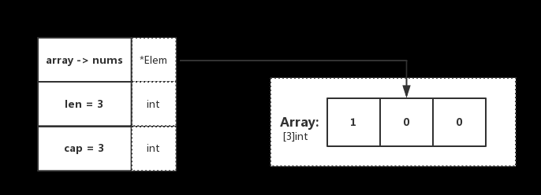
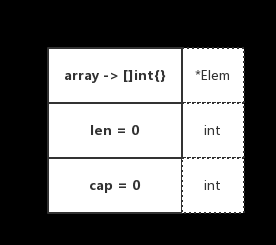
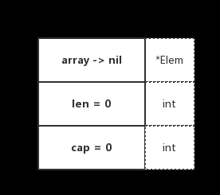

## 1、前言
* 在 Go 中，Slice（切片）是抽象在 Array（数组）之上的特殊类型。为了更好地了解 Slice，第一步需要先对 Array 进行理解。深刻了解 Slice 与 Array 之间的区别后，就能更好的对其底层一番摸索
* Array用法
```
func main() {
    nums := [3]int{}
    nums[0] = 1

    n := nums[0]
    n = 2

    fmt.Printf("nums: %v\n", nums)
    fmt.Printf("n: %d\n", n)
}

// 输出结果
nums: [1 0 0] 
n: 2
```
* 我们可得知在 Go 中，数组类型需要指定长度和元素类型。在上述代码中，可得知 [3]int{} 表示 3 个整数的数组，并进行了初始化。底层数据存储为一段连续的内存空间，通过固定的索引值（下标）进行检索

* 数组在声明后，其元素的初始值（也就是零值）为 0。并且该变量可以直接使用，不需要特殊操作
同时数组的长度是固定的，它的长度是类型的一部分，因此 [3]int 和 [4]int 在类型上是不同的，不能称为 “一个东西”

## 2、slice
```
func main() {
    nums := [3]int{}
    nums[0] = 1

    dnums := nums[:]

    fmt.Printf("dnums: %v", dnums)
}
```
* Slice 是对 Array 的抽象，类型为 []T。在上述代码中，dnums 变量通过 nums[:] 进行赋值。需要注意的是，Slice 和 Array 不一样，它不需要指定长度。也更加的灵活，能够自动扩容
* 数据结构
```
type slice struct {
    array unsafe.Pointer
    len   int
    cap   int
}
```
* Slice 的底层数据结构共分为三部分，如下：
    * array：指向所引用的数组指针（unsafe.Pointer 可以表示任何可寻址的值的指针）
    * len：长度，当前引用切片的元素个数
    * cap：容量，当前引用切片的容量（底层数组的元素总数）
* 在实际使用中，cap 一定是大于或等于 len 的。否则会导致 panic
* 为了更好的理解，我们回顾上小节的代码便于演示，如下：
```
func main() {
    nums := [3]int{}
    nums[0] = 1

    dnums := nums[:]

    fmt.Printf("dnums: %v", dnums)
}
```

* 在代码中，可观察到 dnums := nums[:]，这段代码确定了 Slice 的 Pointer 指向数组，且 len 和 cap 都为数组的基础属性。与图示表达一致
* len、cap 不同
```
func main() {
    nums := [3]int{}
    nums[0] = 1

    dnums := nums[0:2]

    fmt.Printf("dnums: %v, len: %d, cap: %d", dnums, len(dnums), cap(dnums))
}

// 输出结果
dnums: [1 0], len: 2, cap: 3
```
显然，在这里指定了 Slice[0:2]，因此 len 为所引用元素的个数，cap 为所引用的数组元素总个数。与期待一致
## 3、slice创建
* Slice 的创建有两种方式，如下：
```
var []T 或 []T{}
func make（[] T，len，cap）[] T
```
* 可以留意 make 函数，我们都知道 Slice 需要指向一个 Array。那 make 是怎么做的呢？
* 它会在调用 make 的时候，分配一个数组并返回引用该数组的 Slice
```
func makeslice(et *_type, len, cap int) slice {
    //  根据传入的 Slice 类型，获取其类型能够申请的最大容量大小
    maxElements := maxSliceCap(et.size)
    
    // 判断 len 是否合规，检查是否在 0 < x < maxElements 范围内
    if len < 0 || uintptr(len) > maxElements {
        panic(errorString("makeslice: len out of range"))
    }

    // 判断 cap 是否合规，检查是否在 len < x < maxElements 范围内
    if cap < len || uintptr(cap) > maxElements {
        panic(errorString("makeslice: cap out of range"))
    }

    // 申请 Slice 所需的内存空间对象。若为大型对象（大于 32 KB）则直接从堆中分配
    p := mallocgc(et.size*uintptr(cap), et, true)
    
    // 返回申请成功的 Slice 内存地址和相关属性（默认返回申请到的内存起始地址）
    return slice{p, len, cap}
}
```

## 4、slice扩容
* 当使用 Slice 时，若存储的元素不断增长（例如通过 append）。当条件满足扩容的策略时，将会触发自动扩容，那么分别是什么规则呢？让我们一起看看源码是怎么说的 😄
* zerobase
```
// 与append(slice,s)对应的函数growslice
// 通过切片的类型，旧切片的容量和数据得出新切片的容量，新切片跟据容量重新申请一块地址，把旧切片的数据拷贝到新切片中

func growslice(et *_type, old slice, cap int) slice {
    // ...
    // 当 Slice size 为 0 时
    // 单纯地扩容，不写数据
    if et.size == 0 {

        // 若将要扩容的容量比原本的容量小，则抛出异常（也就是不支持缩容操作)
        if cap < old.cap {
            panic(errorString("growslice: cap out of range"))
        }

        // 否则，将重新生成一个新的 Slice 返回，其 Pointer 指向一个 0 byte 地址（不会保留老的 Array 指向）
        return slice{unsafe.Pointer(&zerobase), old.len, cap}
    }

    // ...
}
```
* **若将要扩容的容量比原本的容量小，则抛出异常（也就是不支持缩容操作)**
## 5、slice扩容策略
#### 5-1 扩容的计算策略
```
// 与append(slice,s)对应的函数growslice
// 通过切片的类型，旧切片的容量和数据得出新切片的容量，新切片跟据容量重新申请一块地址，把旧切片的数据拷贝到新切片中

func growslice(et *_type, old slice, cap int) slice {
    ...
    newcap := old.cap
    doublecap := newcap + newcap
    
    // 若 Slice cap 大于 doublecap，则扩容后容量大小为 新 Slice 的容量
    // 超了基准值，我就只给你需要的容量大小
    if cap > doublecap {
        newcap = cap
    } else {
        
        // 若 Slice len 小于 1024 个，在扩容时，增长因子为 1（也就是 3 个变 6 个）
        if old.len < 1024 {
            newcap = doublecap
        } else {

            // 若 Slice len 大于 1024 个，在扩容时，增长因子为 0.25（原本容量的四分之一）
            for 0 < newcap && newcap < cap {
                newcap += newcap / 4
            }
            ...
        }
    }
    ...
}
```
* **注：也就是小于 1024 个时，增长 2 倍。大于 1024 个时，增长 1.25 倍,这里扩容仅仅针对cap**

#### 5-2 扩容的内存策略
```
func growslice(et *_type, old slice, cap int) slice {
    // ...
    
    
    // 1、上述代码片段仅会确定切片的大致容量，下面还需要根据切片中的元素大小对齐内存
    // 当数组中元素所占的字节大小为 1、8 或者 2 的倍数时，运行时会使用如下所示的代码对齐内存
    var lenmem, newlenmem, capmem uintptr
    const ptrSize = unsafe.Sizeof((*byte)(nil))
    switch et.size {
    case 1:
        lenmem = uintptr(old.len) 
        newlenmem = uintptr(cap) 
        capmem = roundupsize(uintptr(newcap)) 
        newcap = int(capmem)
    case ptrSize:
        lenmem = uintptr(old.len) * ptrSize
        newlenmem = uintptr(cap) * ptrSize
        capmem = roundupsize(uintptr(newcap) * ptrSize)
        newcap = int(capmem / ptrSize)

    // 在默认情况下，我们会将目标容量和元素大小相乘得到占用的内存
    // 如果计算新容量时发生了内存溢出或者请求内存超过上限，就会直接崩溃退出程序
    // 不过这里为了减少理解的成本，将相关的代码省略了
    default:
        lenmem = uintptr(old.len) * et.size             // 旧的
        newlenmem = uintptr(cap) * et.size              // 用户期望的
        capmem = roundupsize(uintptr(newcap) * et.size) // 实际计算出来的
        newcap = int(capmem / et.size)
    }...
    }

    // 2、确定新 Slice 容量大于老 Sice，并且新容量内存小于指定的最大内存、没有溢出
    // 否则抛出异常
    if cap < old.cap || overflow || capmem > _MaxMem {
        panic(errorString("growslice: cap out of range"))
    }

    var p unsafe.Pointer

    // 下面源代码有待继续深入学习

    // 3、如果切片中元素不是指针类型
    // 那么会调用 runtime.memclrNoHeapPointers 将超出切片当前长度的位置清空并在最后使用 runtime.memmove 将原数组内存中的内容拷贝到新申请的内存中。
    // 这两个方法都是用目标机器上的汇编指令实现的，这里就不展开介绍
    if et.kind&kindNoPointers != 0 {

        // 3-1、为新的切片开辟容量为capmem的地址空间
        p = mallocgc(capmem, nil, false)

        // 3-2、将 old.array 上的 n 个 bytes（根据 lenmem）拷贝到新的内存空间上
        memmove(p, old.array, lenmem)

        // 3-3、新内存空间（p）加上新 Slice cap 的容量地址。最终得到完整的新 Slice cap 内存地址 add(p, newlenmem) （ptr）
        // 3-4、从 ptr 开始重新初始化 n 个 bytes（capmem-newlenmem）
        memclrNoHeapPointers(add(p, newlenmem), capmem-newlenmem)
    } else {

         // 4、重新申请并初始化一块内存给新 Slice 用于存储 Array
        p = mallocgc(capmem, et, true)

        // 5-1、检测当前是否正在执行 GC，也就是当前是否启用 Write Barrier（写屏障），若启用则通过 typedmemmove 方法，利用指针运算循环拷贝。
        // 5-2、否则通过 memmove 方法采取整体拷贝的方式将 lenmem 个字节从 old.array 拷贝到 ptr，以此达到更高的效率typedmemmove(et, add(p, i), add
        if !writeBarrier.enabled {
            memmove(p, old.array, lenmem)
        } else {
        
            for i := uintptr(0); i < lenmem; i += et.size {
          
                typedmemmove(et, add(p, i), add(old.array, i))
            }
        }
    }
    ...
}
```
* [对齐机制roundupsize详解](1.7-slice调用append内存对齐机制.md)
* 那么问题来了，**为什么要重新初始化这块内存呢(mallocgc())**?
  * 这是因为 ptr 是未初始化的内存（例如：可重用的内存，一般用于新的内存分配），其可能包含 “垃圾”。因此在这里应当进行 “清理”。便于后面实际使用（扩容）

* 注：一般会在 GC 标记阶段启用 Write Barrier，并且 Write Barrier 只针对指针启用。那么在第 5 点中，你就不难理解为什么会有两种截然不同的处理方式了

* 这里需要注意的是，扩容时的内存管理的选择项，如下：
    * 翻新扩展：当前元素为 kindNoPointers **（非指针）**，将在老 Slice cap 的地址后继续申请空间用于扩容
    * 举家搬迁：重新申请一块内存地址，整体迁移并扩容
## 6、两个小 “陷阱”
#### 6-1 同根
```
func main() {
    nums := [3]int{}
    nums[0] = 1

    fmt.Printf("nums: %v , len: %d, cap: %d\n", nums, len(nums), cap(nums))

    dnums := nums[0:2]
    dnums[0] = 5

    fmt.Printf("nums: %v ,len: %d, cap: %d\n", nums, len(nums), cap(nums))
    fmt.Printf("dnums: %v, len: %d, cap: %d\n", dnums, len(dnums), cap(dnums))
}

// 输出结果：
nums: [1 0 0] , len: 3, cap: 3
nums: [5 0 0] ,len: 3, cap: 3
dnums: [5 0], len: 2, cap: 3
```
* 在未扩容前，Slice array 指向所引用的 Array。因此在 Slice 上的变更。会直接修改到原始 Array 上（两者所引用的是同一个）

#### 6-2 时过境迁
* 随着 Slice 不断 append，内在的元素越来越多，终于触发了扩容。如下代码：
```
func main() {
    nums := [3]int{}
    nums[0] = 1

    fmt.Printf("nums: %v , len: %d, cap: %d\n", nums, len(nums), cap(nums))

    dnums := nums[0:2]
    dnums = append(dnums, []int{2, 3}...)
    dnums[1] = 1

    fmt.Printf("nums: %v ,len: %d, cap: %d\n", nums, len(nums), cap(nums))
    fmt.Printf("dnums: %v, len: %d, cap: %d\n", dnums, len(dnums), cap(dnums))
}
// 输出结果：
nums: [1 0 0] , len: 3, cap: 3
nums: [1 0 0] ,len: 3, cap: 3
dnums: [1 1 2 3], len: 4, cap: 6
```
* 往 Slice append 元素时，若满足扩容策略，也就是假设插入后，原本数组的容量就超过最大值了
* 这时候内部就会重新申请一块内存空间，将原本的元素拷贝一份到新的内存空间上。此时其与原本的数组就没有任何关联关系了，再进行修改值也不会变动到原始数组。这是需要注意的

## 7、 slice复制
```
// 原型
// copy 函数将数据从源 Slice复制到目标 Slice。它返回复制的元素数
func copy（dst，src [] T）int
```
```
func main() {
    dst := []int{1, 2, 3}
    src := []int{4, 5, 6, 7, 8}
    n := copy(dst, src)

    fmt.Printf("dst: %v, n: %d", dst, n)
}
```
* copy 函数支持在不同长度的 Slice 之间进行复制，若出现长度不一致，在复制时会按照**最少的 Slice 元素个数**进行复制
* 那么在源码中是如何完成复制这一个行为的呢？我们来一起看看源码的实现，如下：
```
func slicecopy(to, fm slice, width uintptr) int {
    
    // 1、若源 Slice 或目标 Slice 存在长度为 0 的情况，则直接返回 0（因为压根不需要执行复制行为）
    if fm.len == 0 || to.len == 0 {
        return 0
    }

    // 2、通过对比两个 Slice，获取最小的 Slice 长度。便于后续操作
    n := fm.len
    if to.len < n {
        n = to.len
    }

    if width == 0 {
        return n
    }

    ...

    size := uintptr(n) * width

    // 3、若 Slice 只有一个元素，则直接利用指针的特性进行转换
    if size == 1 {
        *(*byte)(to.array) = *(*byte)(fm.array) // known to be a byte pointer
    } else {

        // 4、若 Slice 大于一个元素，则从 fm.array 复制 size 个字节到 to.array 的地址处（会覆盖原有的值）
        memmove(to.array, fm.array, size)
    }
    return n
}
```


## 8、slice初始化
* 在 Slice 中流传着两个传说，分别是 Empty 和 Nil Slice，接下来让我们看看它们的小区别
* Empty
```
func main() {
    nums := []int{}
    renums := make([]int, 0)

    fmt.Printf("nums: %v, len: %d, cap: %d\n", nums, len(nums), cap(nums))
    fmt.Printf("renums: %v, len: %d, cap: %d\n", renums, len(renums), cap(renums))
}
// 输出结果：
nums: [], len: 0, cap: 0
renums: [], len: 0, cap: 0
```
* Nil
```
func main() {
    var nums []int
}
// 输出结果：
nums: [], len: 0, cap: 0
```
* 乍一看，Empty Slice 和 Nil Slice 好像一模一样？不管是 len，还是 cap 都为 0。好像没区别？我们再看看如下代码：
```
func main() {
    var nums []int
    renums := make([]int, 0)
    if nums == nil {
        fmt.Println("nums is nil.")
    }
    if renums == nil {
        fmt.Println("renums is nil.")
    }
}
```
* 两者数据结构如下:
* empty:

* nil


* 从图示中可以看出来，两者有本质上的区别。其底层数组的指向指针是不一样的，Nil Slice 指向的是 nil，Empty Slice 指向的是实际存在的空数组地址
* 可以认为，Nil Slice 代指不存在的 Slice，Empty Slice 代指空集合。两者所代表的意义是完全不同的

## 9、maxSliceCap
#### 9-1 前言
* 上面，我们提到了 “根据其类型大小去获取能够申请的最大容量大小” 的处理逻辑。今天我们将更深入地去探究一下，底层到底做了什么东西，涉及什么知识点？
```
func makeslice(et *_type, len, cap int) slice {
    maxElements := maxSliceCap(et.size)
    if len < 0 || uintptr(len) > maxElements {
        ...
    }

    if cap < len || uintptr(cap) > maxElements {
        ...
    }

    p := mallocgc(et.size*uintptr(cap), et, true)
    return slice{p, len, cap}
}
```
* 根据想要追寻的逻辑，定位到了 maxSliceCap 方法，它会根据当前类型的大小获取到了所允许的最大容量大小来进行阈值判断，也就是安全检查。这是浅层的了解，我们继续追下去看看还做了些什么？
```
func maxSliceCap(elemsize uintptr) uintptr {
    if elemsize < uintptr(len(maxElems)) {
        return maxElems[elemsize]
    }
    return maxAlloc / elemsize
}
```
```
var maxElems = [...]uintptr{
    ^uintptr(0),
    maxAlloc / 1, maxAlloc / 2, maxAlloc / 3, maxAlloc / 4,
    maxAlloc / 5, maxAlloc / 6, maxAlloc / 7, maxAlloc / 8,
    maxAlloc / 9, maxAlloc / 10, maxAlloc / 11, maxAlloc / 12,
    maxAlloc / 13, maxAlloc / 14, maxAlloc / 15, maxAlloc / 16,
    maxAlloc / 17, maxAlloc / 18, maxAlloc / 19, maxAlloc / 20,
    maxAlloc / 21, maxAlloc / 22, maxAlloc / 23, maxAlloc / 24,
    maxAlloc / 25, maxAlloc / 26, maxAlloc / 27, maxAlloc / 28,
    maxAlloc / 29, maxAlloc / 30, maxAlloc / 31, maxAlloc / 32,
}
```
* maxElems 是包含一些预定义的切片最大容量值的查找表，索引是切片元素的类型大小。而值看起来 “奇奇怪怪” 不大眼熟，都是些什么呢。主要是以下三个核心点：
  * ^uintptr(0)
  * maxAlloc
  * maxAlloc / typeSize
#### 9-2 ^uintptr(0)
```
func main() {
    log.Printf("uintptr: %v\n", uintptr(0))
    log.Printf("^uintptr: %v\n", ^uintptr(0))
}

// 输出结果：
2019/01/05 17:51:52 uintptr: 0
2019/01/05 17:51:52 ^uintptr: 18446744073709551615
```
* 我们留意一下输出结果，比较神奇。取反之后为什么是 18446744073709551615 呢？
* 先看一下uintptr 是什么
```
type uintptr uintptr
```
* uintptr 的类型是自定义类型，接着找它的真面目，如下：
```
#ifdef _64BIT
typedef    uint64        uintptr;
#else
typedef    uint32        uintptr;
#endif
```
* 通过对以上代码的分析，可得出以下结论：
    * 在 32 位系统下，uintptr 为 uint32 类型，占用大小为 4 个字节
    * 在 64 位系统下，uintptr 为 uint64 类型，占用大小为 8 个字节
* ^uintptr 做了什么事
^ 位运算符的作用是按位异或，如下：
```
func main() {
    log.Println(^1)
    log.Println(^uint64(0))
}
// 输出结果：
2019/01/05 20:44:49 -2
2019/01/05 20:44:49 18446744073709551615
```
* 接下来我们分析一下，这两段代码都做了什么事情呢
    * ^1
    * 二进制：0001
    * 按位取反：1110
* 该数为有符号整数，最高位为符号位。低三位为表示数值。按位取反后为 1110，根据先前的说明，最高位为 1，因此表示为 -。取反后 110 对应十进制 -2
* ^uint64(0)
    * 二进制：0000 0000 0000 0000 0000 0000 0000 0000 0000 0000 0000 0000 0000 0000 0000 0000
    * 按位取反：1111 1111 1111 1111 1111 1111 1111 1111 1111 1111 1111 1111 1111 1111 1111 1111
    * 该数为无符号整数，该位取反后得到十进制值为：18446744073709551615
* 这个值是不是看起来很眼熟呢？没错，就是 ^uintptr(0) 的值。也印证了其底层数据类型为 uint64 的事实 （本机为 64 位）。同时它又代表如下：
    * math.MaxUint64
    * 2 的 64 次方减 1
#### 9-3 maxAlloc
```
const GoarchMips = 0
const GoarchMipsle = 0
const GoarchWasm = 0
...
_64bit = 1 << (^uintptr(0) >> 63) / 2

heapAddrBits = (_64bit*(1-sys.GoarchWasm))*48 + (1-_64bit+sys.GoarchWasm)*(32-(sys.GoarchMips+sys.GoarchMipsle))

maxAlloc = (1 << heapAddrBits) - (1-_64bit)*1
```
* maxAlloc 是允许**用户分配的最大虚拟内存空间**。在 64 位，理论上可分配最大 1 << heapAddrBits 字节。在 32 位，最大可分配小于 1 << 32 字节
* 在本文，仅需了解它承载的是什么就好了。具体的在以后内存管理的文章再讲述
注：该变量在 go 10.1 为 _MaxMem，go 11.4 已改为 maxAlloc。相关的 heapAddrBits 计算方式也有所改变
#### 9-4 maxAlloc / typeSize
* 我们再次回顾 maxSliceCap 的逻辑代码，这次重点放在控制逻辑，如下：
```
// func makeslice
maxElements := maxSliceCap(et.size)

...

// func maxSliceCap
if elemsize < uintptr(len(maxElems)) {
    return maxElems[elemsize]
}
return maxAlloc / elemsize
```
* 通过这段代码和 Slice 上下文逻辑，可得知在想得到该类型的最大容量大小时。会根据**对应的类型大小**去查找表查找索引（索引为类型大小，摆放顺序是有考虑原因的）。
* “迫不得已的情况下” **(不在表中)** 才会手动的计算它的值，最终计算得到的内存字节大小都为该类型大小的**整数倍**
* 查找表的设置，更像是一个优化逻辑。减少常用的计算开销 