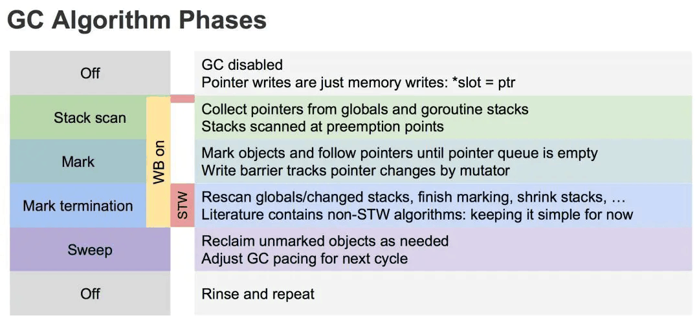
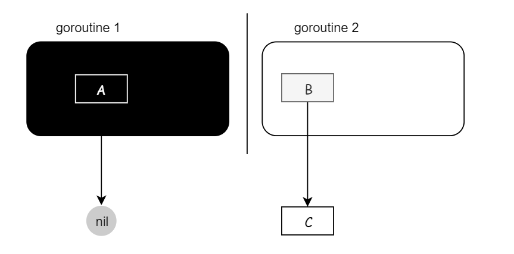
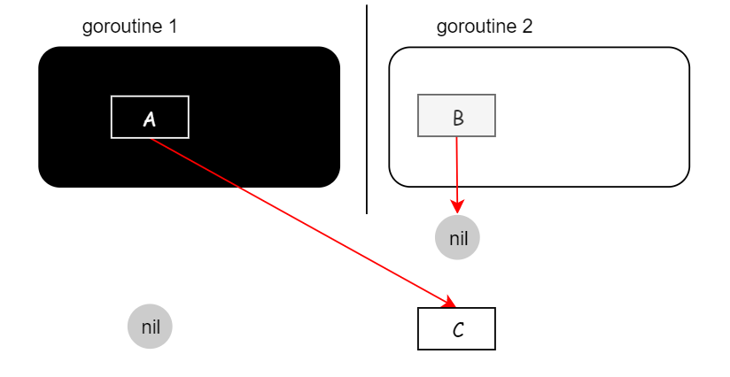

>首先明白一个前提，栈上，寄存器对象的赋值（插入，删除）不能 hook ，这个因为实力不允许（太复杂，做不到）。
## 1、引言
#### 1-1 为什么是三色，而不是两色
* 灰色向黑色变化的过程可以理解成：标记所有不可删除节点的过程
* 在这个过程中，如果没有STW，导致引用继续发生变化，出现错误
* 重要的是理解三种颜色表示的三种状态
    * 白色，初始值。本次回收没被扫描过的对象默认都是白色的。而确认不可达的对象也是白色，但是会被标记「不可达」。
    * 灰色，中间状态。本对象有被外部引用，但是本对象引用的其它对象尚未全部检测完。
    * 黑色，本对象有被其它对象引用，且已检测完本对象引用的其它对象。

#### 1-2 如果没有STW，导致错误的两个条件
* 条件1: 一个白色对象被黑色对象引用(白色被挂在黑色下)
* 条件2: 灰色对象与它之间的可达关系的白色对象遭到破坏(灰色同时丢了该白色)
* 当以上两个条件同时满足时, 就会出现对象丢失现象!

#### 1-3 如何破坏上面的两个条件
* 插入屏障
* 删除屏障

## 2、插入屏障

#### 2-1 介绍
* 具体操作: 在A对象引用B对象的时候，B对象被标记为灰色。(将B挂在A下游，B必须被标记为灰色)

* 满足: 强三色不变式. (不存在黑色对象引用白色对象的情况了， 因为白色会强制变成灰色)
* 伪码如下:
```
添加下游对象(当前下游对象slot, 新下游对象ptr) {   
  //1
  标记灰色(新下游对象ptr)   
  
  //2
  当前下游对象slot = 新下游对象ptr                    
}
```
* 场景：
```
A.添加下游对象(nil, B)   //A 之前没有下游， 新添加一个下游对象B， B被标记为灰色
A.添加下游对象(C, B)     //A 将下游对象C 更换为B，  B被标记为灰色
```

* 解释如下
* 1、正常情况下，写操作就是正常的赋值。
* 2、GC 开始，开启写屏障等准备工作。开启写屏障等准备工作需要短暂的 STW。
* 3、Stack scan 阶段，从全局空间和 goroutine 栈空间上收集变量。
* 4、Mark 阶段，执行上述的三色标记法，直到没有灰色对象。
* 5、Mark termination 阶段，开启 STW，回**头重新扫描 root 区域新变量，对他们进行标记**。
* 6、Sweep 阶段，关闭 STW 和 写屏障，对白色对象进行清除。
#### 2-2 局限性/优势
* rescan stack：重新扫描stack
* rescan stack：重新扫描stack
> 优势：比传统GC好在没有在整个mark阶段都stc
> 劣势：任然要rescan stack（STW），没有解决根本问题

#### 2-3 总结
* 如果是纯粹的插入写屏障是满足强三色不变式的（永远不会出现黑色对象指向白色对象）；
* 上一步没有扫描过的stack对象（由于没有stw导致新加入的stack对象）又指向白色对象，导致丢失，所以要resacn stack（虽然可以工作，但是这里仍然要stw，没有解决stw的根本原因）


## 3、删除写屏障
#### 3-1 介绍

* 具体操作: 被删除的对象，如果自身为灰色或者白色，那么被标记为灰色。

* 满足: 弱三色不变式. (保护灰色对象到白色对象的路径不会断)

* 伪代码：
```
添加下游对象(当前下游对象slot， 新下游对象ptr) {
  //1
  if (当前下游对象slot是灰色 || 当前下游对象slot是白色) {
          标记灰色(当前下游对象slot)     //slot为被删除对象， 标记为灰色
  }
  
  //2
  当前下游对象slot = 新下游对象ptr
}
```
* 场景：
```
A.添加下游对象(B, nil)   //A对象，删除B对象的引用。  B被A删除，被标记为灰(如果B之前为白)
A.添加下游对象(B, C)         //A对象，更换下游B变成C。   B被A删除，被标记为灰(如果B之前为白)
接
```
#### 3-2 局限性
* 这种方式的回收精度低，一个对象即使被删除了最后一个指向它的指针也**依旧可以活过这一轮GC**，在下一轮GC中被清理掉
#### 3-3 删除写屏障中，我不整机暂停 STW 栈，而是一个栈一个栈的快照，这样也没有 STW 了，是否可以满足要求？

* 不行，纯粹的删除写屏障，起始必须整个栈打快照，要把所有的堆对象都处于灰色保护中才行。
>这个就是当前 golang 混合写屏障的时候做的哈，虽然没有 STW 了，但是扫描到某一个具体的栈的时候，还是要暂停这一个 goroutine 的）
#### 3-4 删除写屏障中，保证正确的各种方案
* 方法一：栈上对象也 hook，所有对象赋值（插入，删除）都 hook（这个就不实际了）;所有的插入，删除如果都 hook ，那么一定都不会有问题，虽然本轮精度很差，但是下轮回收可以回收了。但是还是那句话，栈，寄存器的赋值 hook 是不现实的。

* 方法二：起始快照整栈跨找，扫黑，使得整个堆上的在用对象都处于灰色保护；**整栈扫黑 ！！！**，那么在用的堆上的对象是一定处于灰色堆对象的保护下的（配合堆对象删除写屏障），**(全局STW)**

* 方法三：**加入插入写屏障的逻辑**，C 指向 D 的时候，把 D 置灰，这样扫描也没问题。这样就能去掉起始 STW 扫描，从而可以并发，一个一个栈扫描。**(各个goroutine相继/并发STW)**
>细品下，这不就成了当前在用的混合写屏障了，所以我觉得正确的理解方式应该是：混合写屏障 = 删除写屏障 + 插入写屏障，必须先理解下删除写屏障，你才能理解混合写屏障。
> 或者说：混合写屏障 = 起始不需要STW的删除写屏障

#### 3-6 删除写屏障在栈上面可以使用吗？
* 这个的要看怎么理解使用了
* 起始必须整个栈打快照，要把所有的**堆对象**都处于灰色保护中才行，保护了堆上面的对象，但是对于栈上面的对象就没有保护了

#### 3-5 总结
* 删除写屏障也叫基于快照的写屏障方案，必须在起始时，**STW** 扫描整个栈（ **注意了，是所有的 goroutine 栈** ） ，保证所有堆上在用的对象都处于灰色保护下，保证的是弱三色不变式；
* 由于起始快照的原因，起始也是执行 STW，删除写屏障不适用于栈特别大的场景，栈越大，STW 扫描时间越长，对于现代服务器上的程序来说，栈地址空间都很大，所以删除写屏障都不适用，一般适用于很小的栈内存，比如嵌入式，物联网的一些程序；
* 并且删除写屏障会导致扫描进度（波面）的后退，所以扫描精度不如插入写屏障；


## 4、Go V1.8的混合写屏障(hybrid write barrier)机制
#### 4-1 介绍
* 具体操作:
    * 1、GC开始将栈上的对象全部扫描并标记为黑色(之后不再进行第二次重复扫描，无需STW，只要各个goroutine相继STW)，

    * 2、GC期间，任何在栈上创建的新对象，均为黑色（不用rescan stack）。

    * 3、被删除的对象标记为灰色。

    * 4、被添加的对象标记为灰色。

    * **满足: 变形的弱三色不变式**

* 伪代码：
```
添加下游对象(当前下游对象slot, 新下游对象ptr) {
      //1 
        标记灰色(当前下游对象slot)    //只要当前下游对象被移走，就标记灰色
      
      //2 
      标记灰色(新下游对象ptr)
          
      //3
      当前下游对象slot = 新下游对象ptr
}
```
* **这里我们注意， 屏障技术是不在栈上应用的，因为要保证栈的运行效率。**

#### 4-2 将栈区全部标记位黑色，那么怎么删除垃圾？
* 上面两点只有一个目的，将栈上的可达对象全部标黑，最后无需对栈进行STW，就可以保证栈上的对象不会丢失。**但是**，标记为黑色的是**可达对象**，**不可达的对象一直会是白色**，直到最后被回收。

#### 4-3 万一栈上的对象A引用了堆上的对象B，由于栈区不触发混合写屏障机制，那对象B一直是白色的，最后不就被垃圾回收走了么，谁来保护它？
* 这个情况是不会发生的，因为一个对象之所以可以引用另外一个对象，**它的前提是需要另外一个对象可达**，B如果可达，自然有B的上游保护，如果不可达的，A也引用不到B

#### 4-4 类似上面的问题，混合写屏障是全面去除 STW 的一个改进，转而并发一个一个栈处理的方式（每个栈单独暂停），从而消除了整机 STW 的影响，带来了吞吐的提升。有没有想过，这种 STW 整个系统栈，而只暂停一个 goroutine 栈会不会有问题比如下面：

* 初始状态：
    * goroutine 1 已经被扫描黑了（由于混合写屏障的场景，赋值器是黑色赋值器，之后不会在扫描了），goroutine 1 上的 A 对象 指向 nil ；
    * B 唯一指向 C（灰色的栈对象 B，白色的 C 对象）；


* 操作：赋值器（g1）把 A 指向 C，赋值器（g2）把 B 指向 nil，删除 B -> C 的引用，由于A，B 都是栈上的对象，所以这里的赋值都不会触发写屏障


* 这样操作下来，是不是就有问题了？
    * 黑色的 A 指向了白色的 C，并且是唯一指向。由于我们说混合写屏障这里是黑色赋值器，黑色的 goroutine 1 栈是不会再扫描了，那等扫描完了，C 岂不是被错误回收了 ！！！

* 这里不会哈。因为这种情况不会出现，证明如下：
    * goroutine 1 栈上的黑色对象 A 引用白色对象 C 只有两种场景：
        * goroutine 1 持有 goroutine 2 栈上的对象：g1 不能直接持有 B，不同栈的对象是无法相互访问的，否则就会溢出到堆上； 
        * goroutine 1 持有对象对象 C：g1 不能直接持有 C，直接持有它就违反了假设，并且如果真是直接持有 C，C 一定是灰色的；
    * 旁白，理解一句话，对象不是天上掉下来的，一定是有路可循的。
    * 撇开这个上面的假设，如果 A 非要引用到 C ，可以通过 A 下面的一个对象 X （ X 指向 C）来获取，但如此一来，C 一定会处于灰色保护下;

#### 4-5 混合写屏障中真的不会STW吗
* 会STW
* 第一步做标记的过程又可以分成两个步骤。
    * 标记 GC ROOT 能关联到的对象。这里会 STW，（GC 开始，开启写屏障等准备工作。开启写屏障等准备工作需要**短暂**的 STW）。
    * 从 GCRoots 的直接关联对象开始遍历整个对象图。这里不会STW

#### 4-6 怎么理解混合写屏障的出现
* 混合写屏障 = 删除写屏障 + 插入写屏障
* 或者说：混合写屏障 = 起始不需要STW（**1、一个个g的栈进行插入屏障，使得所有堆对象处于灰色保护，并且栈全黑了）** 的删除写屏障（**2、不用回头STW栈，因为栈全黑了**）
#### 4-7 循环引用会回收吗
* 会，白色就会回收，怎么出现白色？每一轮开始，从rootgc出发（到达全局变量、stack），尽管有循环引用，但是如果到不了的，仍然是白色，如果可以到到的话就不是白色，无法清除。
#### 4-7 总结
* 混合写屏障继承**了插入写屏障**的优点，**起始无需 STW 打快照**，直接并发扫描垃圾即可；
* 混合写屏障继承了删除写屏障的优点，赋值器是黑色赋值器，扫描过一次就不需要扫描了，这样就消除了插入写屏障时期**最后 STW 的重新扫描栈**；
* **混合写屏障扫描精度继承了删除写屏障，比插入写屏障更低，随着带来的是 GC 过程全程无 STW；**
* 混合写屏障扫描栈虽然没有 STW，但是扫描某一个具体的栈的时候，还是要停止这个 goroutine 赋值器的工作的哈（针对一个 goroutine 栈来说，是暂停扫的，要么全灰，要么全黑哈，原子状态切换）；（全局stw->并发swt）
* 此外，开启写屏障等准备工作需要短暂的 STW
