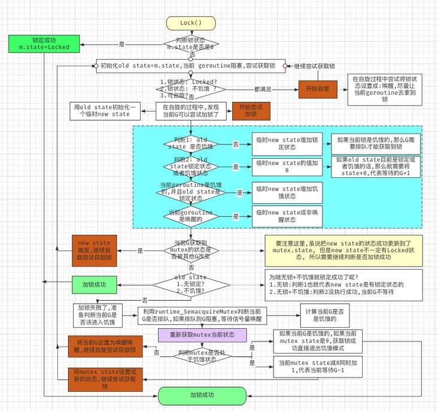
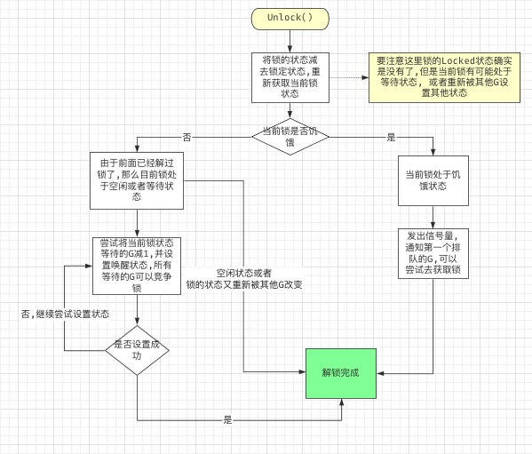
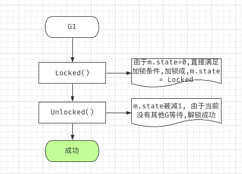
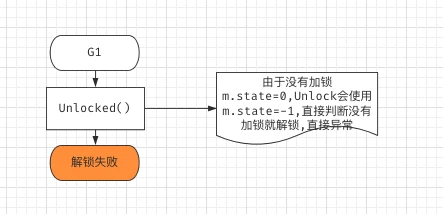
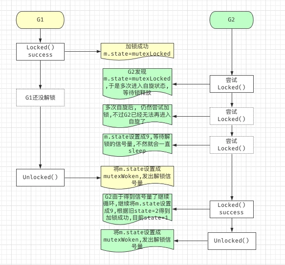
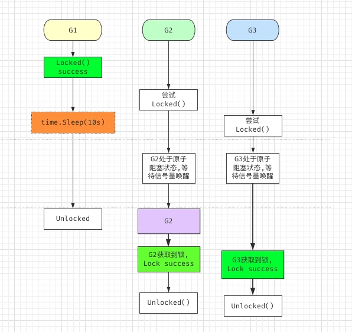
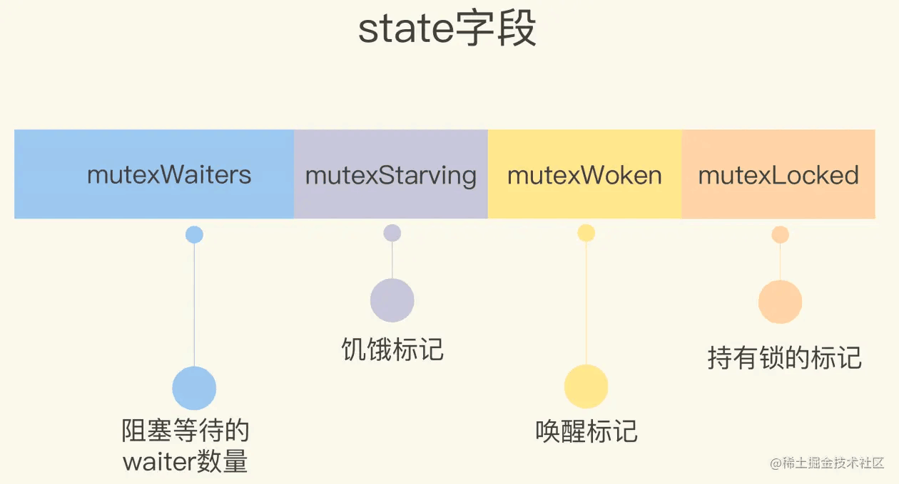

## 1、前言
* Go mutex 源码只有短短的 228 行，但是却包含了很多的状态转变在里面，很不容易看懂，具体可以参见下面的流程图。Mutex 的实现主要借助了**CAS 指令 + 自旋 + 信号量** 来实现

* 整篇源码其实涉及比较难以理解的就是 Mutex 状态（mutexLocked，mutexWoken，mutexStarving，mutexWaiterShift） 与 Goroutine 之间的状态（starving，awoke）改变， 我们下面将逐一说明。
* 介绍的三个角度：
    * 互斥
    * 增加运行中的协程获取锁的机会
    * 解决饥饿问题


## 2、几个典型的流程图
* lock

* unlock


* 一个 goroutine 加锁解锁过程


* 没有加锁直接解锁问题


* 两个 Goroutine，互相加锁解锁


* 三个 Goroutine 等待加锁过程



## 3、概念的介绍 
#### 3-1 什么是 Goroutine 排队?
* 如果 Mutex 已经被一个 Goroutine 获取了锁, 其它等待中的 Goroutine 们只能一直等待。那么等这个锁释放后，等待中的 Goroutine 中哪一个会优先获取 Mutex 呢?

* 正常情况下, 当一个 Goroutine 获取到锁后, 其他的 Goroutine 开始进入**自旋转(为了持有CPU)** 或者进入**沉睡阻塞状态(等待信号量唤醒)**. 但是这里存在一个问题, 新请求的 Goroutine 进入自旋时是仍然拥有 CPU 的, 所以比等待信号量唤醒的 Goroutine 更容易获取锁. 
> 用官方话说就是，新请求锁的 Goroutine具有优势，它正在CPU上执行，而且可能有好几个，所以刚刚唤醒的 Goroutine 有很大可能在锁竞争中失败.

* 于是如果一个 Goroutine 被唤醒过后, 仍然没有拿到锁, 那么该 Goroutine 会放在等待队列的最前面. **并且那些等待超过 1 ms 的 Goroutine 还没有获取到锁**，该 Goroutine 就会进入**饥饿状态**。该 Goroutine 是饥饿状态并且 Mutex 是 Locked 状态时，才有可能给 Mutex 设置成饥饿状态.

* 获取到锁的 Goroutine Unlock, 将 Mutex 的 Locked 状态解除, 发出来解锁信号, 等待的 Goroutine 开始竞争该信号. 如果发现当前 Mutex 是饥饿状态, 直接将唤醒信号发给第一个等待的 Goroutine(**如上面所说，饥饿状态的Goroutine排在队列的最前面**)

#### 3-2 正常模式和饥饿模式 
* 在正常模式下，锁的等待者会按照**先进先出**的顺序获取锁。但是刚被唤起的 Goroutine 与新创建的 Goroutine 竞争时，**大概率会获取不到锁**，为了减少这种情况的出现，一旦 Goroutine 超过 1ms 没有获取到锁，它就会将当前互斥锁切换饥饿模式，防止部分 Goroutine 被『饿死』

* 在饥饿模式中，互斥锁会直接交给等待队列最前面的 Goroutine。新的 Goroutine 在该状态下不能获取锁、也不会进入自旋状态，它们只会在队列的末尾等待。如果一个 Goroutine 获得了互斥锁并且它在队列的末尾或者它等待的时间少于 1ms，那么当前的互斥锁就会切换回正常模式。

* 与饥饿模式相比，正常模式下的互斥锁能够提供更好地性能，饥饿模式的能避免 Goroutine 由于陷入等待无法获取锁而造成的高尾延时

#### 3-3 什么是自旋
* 自旋是一种多线程同步机制，**当前的进程在进入自旋的过程中会一直保持 CPU 的占用**，持续检查某个条件是否为真。在多核的 CPU 上，自旋可以避免 Goroutine 的切换，使用恰当会对性能带来很大的增益，但是使用的不恰当就会拖慢整个程序，所以 Goroutine 进入自旋的条件非常苛刻：
  * 互斥锁只有在普通模式才能进入自旋；
  * runtime.sync_runtime_canSpin 需要返回 true：
    * 运行在多 CPU 的机器上；
    * 当前 Goroutine 为了获取该锁进入自旋的次数小于四次；
    * 当前机器上至少存在一个正在运行的处理器 P 并且处理的运行队列为空
* 一旦当前 Goroutine 能够进入自旋就会调用runtime.sync_runtime_doSpin 和 runtime.procyield 并执行 30 次的 PAUSE 指令，**该指令只会占用 CPU 并消耗 CPU 时间**：
```
func sync_runtime_doSpin() {
	procyield(active_spin_cnt)
}
```
## 4、源码分析

#### 4-1 tip
* 自增长:在 golang 中，一个方便的习惯就是使用 iota 标示符，它简化了常量用于增长数字的定义，给以上相同的值以准确的分类。
```
const (
    CategoryBooks = iota // 0
    CategoryHealth       // 1
    CategoryClothing     // 2
)
```
#### 4-2 Mutex结构体
* Mutex互斥锁有state状态、sema信号量两个字段。其中，state字段表示锁的状态；sema信号量可以理解为互斥锁的唯一标识，用于将协程放入等待队列和从等待队列中唤醒协程。
```
type Mutex struct {
    // 状态变量，表示锁的状态(等待协程数、饥饿状态、是否存在运行中的协程、是否被持有)
    state int32 		
    
    // 信号量，用于从等待队列中唤醒协程
    sema  uint32		
}

const (
    // 锁标识位(state的最后一位) 
    // Mutex.state&mutexLocked==1表示已经上锁；Mutex.state&mutexLocked==0表示已经未锁
    mutexLocked = 1 << iota      
    
    // 是否存在运行中的协程（state的倒数第二位）
    // Mutex.state&mutexWoken==1表示存在运行中的协程；Mutex.state&mutexWoken==0表示不存在运行中的协程
    mutexWoken
    
    // 饥饿状态位(state的倒数第三位)
    // Mutex.state&mutexStarving==1表示饥饿；Mutex.state&mutexStarving==0表示不饥饿
    mutexStarving
    
    // 这个时候：iota = 3
    // 等待者数量偏移量(值为3)
    // Mutex.state右移3位表示等待队列中阻塞协程的数量，即有多少协程由于该锁阻塞
    // 右移失去的3位是上面提到的3个标识
    mutexWaiterShift = iota
）
```
* state结构如下

#### 4-3 角度一：互斥
* 锁的互斥通过mutexLocked标志位实现
  * 当mutexLocked标志位为1时，表示锁已经被持有，其他协程需要进入等待队列
  * 当mutexLocked为0时，表示锁没有被持有，协程可通过CAS操作将mutexLocked标志位设置为1来夺取锁资源。
> CAS是什么? CAS是英文单词CompareAndSwap的缩写，中文意思是：比较并替换。CAS需要有3个操作数：内存地址V，旧的预期值A，即将要更新的目标值B。CAS指令执行时，当且仅当内存地址V的值与预期值A相等时，将内存地址V的值修改为B，否则就什么都不做。整个比较并替换的操作是一个原子操作

* Lock()方法的流程如下：
    * 【1】读取锁的状态；
    * 【2】通过CAS操作对锁的状态进行更新；CAS操作失败返回步骤1，成功进入步骤3；
    * 【3】判断当前协程是否成功持有锁资源；
      * 【3-1】成功 -> 退出Lock()方法，执行临界区的代码；
      * 【3-2】失败 -> 进入等待队列，等待被持有锁资源的协程唤醒；唤醒后重新执行步骤1；
```
// Lock 争夺锁资源
func (m *Mutex) Lock() {
    // 幸运的情况,如果时间片刚刚好轮转到这个Goroutine，原子操作直接拿下mutex
    // 当前锁没有被任何协程持有，并且上锁成功，直接返回、
    // mutex.state 由全0变化成000000...00001
    if atomic.CompareAndSwapInt32(&m.state, 0, mutexLocked) {
        return
    }
    
    // 读取锁的状态
    old := m.state
    for {
        new := old

        // 将锁的新状态设为被持有
        new |= mutexLocked

        // 如果锁已经被持有，将等待协程数+1
        if old&mutexLocked != 0 {
            new += 1 << mutexWaiterShift
        }
        // CAS操作
        if atomic.CompareAndSwapInt32(&m.state, old, new) { 
            // 锁的原始状态为没有被持有，则当前协程争夺锁资源成功，退出for循环
            if old&(mutexLocked) == 0 { 
                break
            }

            // 锁已经被其他协程持有，当前协程进入等待队列 (false -> 队尾)
            // 下面的代码不会继续执行了
            runtime_SemacquireMutex(&m.sema, false, 1)
            
            // 没有break，就继续循环
            // 从等待队列中唤醒的协程，重新读取锁的status
            old := m.state
        } else { 
            
            // CAS失败，重新竞争锁
            old = m.state
        }
    }
}
```
* Unlock()方法的操作如下：
    * 通过atomic.AddInt32(&m.state, -mutexLocked)原子操作将锁的状态切换到未被持有状态
    * 判断是否需要唤醒等待队列中的协程
      * 当锁资源已经被持有或者已经没有等待者的时候，不会从等待队列中唤醒协程
      * 其他情况下，会通过CAS操作从等待队列中唤醒协程。
```
// Unlock 释放锁资源
func (m *Mutex) Unlock() {
    
    // 将锁置为未被持有状态
    // 将最后1位变成0（1 - 1 = 0）
    new := atomic.AddInt32(&m.state, -mutexLocked)
    
    // 幸运的情况
    // 没有协程等待当前锁资源, 直接返回
    if new == 0 {
        return
    }

    // 存在协程等待当前锁资源，需要唤醒其中一个协程
    old := new
    for {
        
        // 1、等待者数量=0 -> 无需释放等待协程
        // 2、或者又被加锁了 -> 不用再释放等待协程 抢夺已经被持有的锁资源
        // 不会再唤醒等待者了，unlock方法可以return了（因为该做的都做了，如更改锁状态）
        if old>>mutexWaiterShift == 0 || old&(mutexLocked) != 0 {
            return
        }
        
        // 将等待当前锁资源的协程数据-1
        new = (old - 1<<mutexWaiterShift)

        // CAS操作
        if atomic.CompareAndSwapInt32(&m.state, old, new) { 
            
            // 唤醒一个等待当前锁资源的协程（队尾）
            runtime_Semrelease(&m.sema, false, 1)
            return
        }
        old = m.state
    }
}
```
* 新版本中，对unlock做了切分，sync.Mutex.unlockSlow，主干方法只剩下一点点了，其他的抽象成unlockSlow()
* unlockSlow()会先校验锁状态的合法性,如果当前互斥锁已经被解锁过了会直接抛出异常 “sync: unlock of unlocked mutex” 中止当前程序。

```
func (m *Mutex) Unlock() {
    new := atomic.AddInt32(&m.state, -mutexLocked)
    if new != 0 {
    	m.unlockSlow(new)
    }
}

func (m *Mutex) unlockSlow(new int32) {
    if (new+mutexLocked)&mutexLocked == 0 {
        throw("sync: unlock of unlocked mutex")
    }
    // ...
}
```
#### 4-4 角度二：增加运行中的协程获取锁的机会
* 从等待队列中唤醒协程需要**上下文切换**的成本，为了减少上下文的切换，Mutex互斥锁在设计上增加了运行中的协程获取锁的机会
* 通过mutexWoken标志位实现
  * mutexWoken标志位为1，表示当前存在运行中的协程争夺锁资源，这时Unlock()方法就不会再从等待队列中唤醒协程来争夺锁。

* Lock()方法的流程如下：
    * 读取锁的状态；
    * **通过自旋操作更新mutexWoken标志位**（告诉Unlock()方法已经存在运行中的协程竞争锁，不要再唤醒协程）；
    * 通过CAS操作对锁的状态进行更新
      * CAS操作失败返回步骤1
      * 成功进入步骤4；
    * 判断当前协程是否成功持有锁资源；
        * 成功 -> 退出Lock()方法，执行临界区的代码；
        * 失败 -> 进入等待队列，等待被持有锁资源的协程唤醒；唤醒后重新执行步骤1；
```
func (m *Mutex) Lock() {
    
    // 幸运case：当前锁没有被任何协程持有，并且上锁成功，直接返回
    if atomic.CompareAndSwapInt32(&m.state, 0, mutexLocked) {
        return
    }

    // awoke变量表示当前协程是否设置了status中的mutexWoken标志位
    awoke := false
    
    // 迭代次数，用于判断是否可以进行自旋操作
    iter := 0
    
    old := m.state
    for {
        
        // 自旋的特殊处理
        // 当mutex被其他协程持有，尝试通过自旋的方式 更新status的mutexWoken标志位
        // 设置mutexWoken标志位后，unlock方法不会再唤醒阻塞中的协程，减少上下文切换的成本
        if old&mutexLocked == mutexLocked && runtime_canSpin(iter) {
            
            // mutexWoken标志位没有被设置，并且锁的等待协程数不为0时
            // 采用CAS操作设置mutexWoken标志位；
            if !awoke && old&mutexWoken == 0 && old>>mutexWaiterShift != 0 && atomic.CompareAndSwapInt32(&m.state, old, old|mutexWoken) {
                
                // mutexWoken设置成功后，将awoke设置为true
                // 表示mutexWoken表示位是当前协程设置的
                // 再次强调：awoke变量表示当前协程是否设置了status中的mutexWoken标志位
                awoke = true
            }

            // 30次pause，cpu空转
            runtime_doSpin()
            
            // 自旋的迭代次数+1
            // 为了防止无限自旋（自旋进入的次数必须小于4次）
            iter++
            
            old = m.state
            continue
        }
        
        //-------- 自旋处理结束，重新开一次循环，开始抢占mutex--------

        new := old
        
        // 当前锁资源已经被其他协程持有，锁资源协程等待数+1
        if old&(mutexLocked) != 0 {
            new += 1 << mutexWaiterShift
        }
        
        // 当前协程设置了mutexWoken标志位，则清除mutexWoken标志位
        if awoke {

            // new是公共的mutex.state
            // 1、前面将mutexWoken=1：为了不让其他g进行unlock的时候，继续唤醒等待者和这个g抢多mutex，
            //    所以在这个g进行抢占的时候，第一步就是进行自旋逻辑
            // 2、现在将mutexWoken=0：无论现在这个g抢占 成功 / 失败，都会让unlock唤醒等待者，
            //    不至于一直没有等待被唤醒（即现在这个g肯定比现在才刚刚唤醒的等待者早强到mutex,mutexWoken的目的已经达到了）
            new &^= mutexWoken
        }
        
        // CAS操作获取锁
        if atomic.CompareAndSwapInt32(&m.state, old, new) {
            
            // 锁的原始状态为没有被持有，则当前协程争夺锁资源成功，退出for循环
            if old&mutexLocked == 0 {
                break
            }
            
            // 当前协程被阻塞，进入等待队列
            runtime_SemacquireMutex(&m.sema, false, 1)

            // 从等待队列中唤醒的协程，重新读取锁的status
            old = m.state
            
            // 在unlock操作中设置了mutexWoken标志位，等价于被唤醒的协程设置了mutexWoken标志位，将awoke设置为true
            // 再次强调：awoke变量表示当前协程是否设置了status中的mutexWoken标志位
            awoke = true
            
            // 自旋还是没抢到mutex，清0重新计算4次
            // 将被唤醒的协程，自旋迭代次数清零
            iter = 0
        } else {
            old = m.state
        }
    }
}
```
* Unlock()方法的操作如下：
    * 通过atomic.AddInt32(&m.state, -mutexLocked)原子操作将锁的状态切换到未被持有状态
    * 判断是否需要唤醒等待队列中的协程
      * 当“锁资源已经被持有”或“已经没有等待者”或“已经有运行中的协程抢夺锁资源”的时候，不会从等待队列中唤醒协程
      * 其他情况下，会通过CAS操作从等待队列中唤醒协程。
```
func (m *Mutex) Unlock() {
    
    //将锁置为未被持有状态
    new := atomic.AddInt32(&m.state, -mutexLocked)
    
    // 幸运case：没有协程等待当前锁资源, 直接返回
    if new == 0 {
        return
    }

    old := new
    for {
        // 锁资源已经没有等待者 -> 无需释放等待协程
        // 锁资源已经上锁 -> 不用再释放等待协程 抢夺已经被持有的锁资源
        // 已经有运行中的协程抢夺锁资源 -> 无需释放等待协程，减少上下文切换的成本
        if old>>mutexWaiterShift == 0 || old&(mutexLocked|mutexWoken) != 0 {
            return
        }
        
        // 唤醒等待队列中的协程，同时将等待协程数-1
        // 并将锁标记为“已经有运行中的协程抢夺锁资源”
        new = (old - 1<<mutexWaiterShift) | mutexWoken
        
        if atomic.CompareAndSwapInt32(&m.state, old, new) {
            runtime_Semrelease(&m.sema, false, 1)
            return
        }
        old = m.state
    }
}
```
* lock的时候会标记mutexWoken=1
* unlock的时候会标记mutexWoken=1（在runtime_SemacquireMutex之后，会重新开一次for循环）
#### 4-5 角度三：饥饿问题
* 每次都给运行中的协程获取锁的机会，会导致已经进入等待队列的协程一直无法获取锁资源，出现饥饿问题。对此，Mutex互斥锁会基于协程的等待时间判断是否需要进入饥饿状态；
* 进入饥饿状态后，**新协程**不再竞争锁，直接进入等待队列的**尾部**，增加旧协程获取锁资源的机会；
* 当等待队列首部处于饥饿状态的协程都成功获取锁资源后，锁会退出饥饿状态。
* Lock()方法的流程如下：
    * 读取锁的状态；
    * 判断锁是否处于饥饿状态mutexStarving：
      * 不是饥饿状态：通过自旋操作更新mutexWoken标志位
      * 饥饿状态：不更新mutexWoken标志位；将mutexWaiterShift等待者数量+1，不竞争锁资源；
    * 通过CAS操作对锁的状态进行更新；
      * CAS操作失败返回步骤1
      * 成功进入步骤4；
    * 判断当前协程是否成功持有锁资源；
        * 成功 -> 退出Lock()方法，执行临界区的代码；
        * 失败 -> 判断协程是否是第一次竞争锁资源：
          * 第一次：记录协程的第一次竞争锁的时间waitStartTime；进入等待队列的尾部；
          * 非第一次：进入等待队列的尾部
        * 当协程从等待队列被唤醒的时候，会判断是否需要切换到饥饿状态，如果锁已经处于饥饿状态，被唤醒的协程不再通过CAS操作竞争锁，直接采用atomic操作获取锁（因为同一时间段只存在一个被唤醒的协程，所以这个操作是安全的。）
```
func (m *Mutex) Lock() {
    // 幸运case：当前锁没有被任何协程持有，并且上锁成功，直接返回
    if atomic.CompareAndSwapInt32(&m.state, 0, mutexLocked) {
        return
    }

    // waitStartTime 记录协程第一次竞争锁的时间
    var waitStartTime int64
    
    // starving 饥饿模式标志
    starving := false
    
    awoke := false
    iter := 0
    old := m.state
    
    for {
        // 如果锁处于不是饥饿状态，自旋的设置锁的唤醒标志mutexWoken
        // 否者，不会设置mutexWoken
        if old&(mutexLocked|mutexStarving) == mutexLocked && runtime_canSpin(iter) {
            // ...
        }

        //-------- 自旋处理结束，重新开一次循环，开始抢占mutex--------

        new := old

        // 如果不在饥饿状态，获取锁
        // 在饥饿状态，当前的g不会获得锁，而是下面unlock中唤醒的对头g获得，当前的会阻塞，看下面的逻辑（下面也会上锁）
        if old&mutexStarving == 0 {
            new |= mutexLocked
        }
        // 当锁处于被持有状态或者处于饥饿状态，当前协程不获取锁，直接进入等待状态
        if old&(mutexLocked|mutexStarving) != 0 {
            new += 1 << mutexWaiterShift
        }

        // 设置饥饿状态
        if starving && old&mutexLocked != 0 {
            new |= mutexStarving
        }

        if awoke {
            new &^= mutexWoken
        }

        // CAS操作
        if atomic.CompareAndSwapInt32(&m.state, old, new) {
            // mutexLocked:锁的原始状态处于未被持有状态 -> 获取锁成功break
            // mutexStarving:在饥饿模式下，当前 Goroutine 会获得互斥锁，因为当前g就是unlock唤醒的对头
            if old&(mutexLocked|mutexStarving) == 0 {
                break
            }

            // waitStartTime为0，表示协程是第一次竞争锁资源，需要记录协程进入等待的时间waitStartTime
            // waitStartTime不为0，表示协程是进入等待队列之后，被唤醒再次争夺锁资源，将queueLifo设为true，进入等待队列的队首位置(LIFO，后进先出)
            queueLifo := waitStartTime != 0
            if waitStartTime == 0 {
                waitStartTime = runtime_nanotime()
            }
            
            // 进入等待队列, 协程进入阻塞状态
            runtime_SemacquireMutex(&m.sema, queueLifo, 1)

            // 协程被唤醒后，基于等待时间判断协程是否处于饥饿状态
            starving = starving || runtime_nanotime()-waitStartTime > starvationThresholdNs
            old = m.state

            // 锁处于饥饿状态，被唤醒的协程直接获取锁资源
            if old&mutexStarving != 0 {
                
                // mutexLocked: 上锁
                // (- 1<<mutexWaiterShift): 因为处于饥饿状态的锁直接唤醒协程，unlock操作的时候没有进行status的更新，这里需要对waiter数量进行更新操作
                delta := int32(mutexLocked - 1<<mutexWaiterShift)
                
                // 1、!starving: 等待队列中前面都是饥饿状态的协程(因为设置了queueLifo)
                // 当被唤醒的协程不是饥饿的,表示其后面都不是饥饿的，需要清除饥饿标志
                // 2、old>>mutexWaiterShift == 1: 当前协程是等待队列中最后一个协程时，需要清除饥饿标志；
                // 其原因是，处于饥饿状态时，运行中的协程直接进入等待队列，只有被唤醒的协程能获取锁
                // 当等待队列为空时，没有及时清除饥饿标识，会导致后续的协程直接进入等待队列，同时也没有协程执行unlock操作
                // 导致 所有协程都进入阻塞状态。
                if !starving || old>>mutexWaiterShift == 1 {
                    delta -= mutexStarving
                }
                
                // 前面上了锁 && 更新数量：delta := int32(mutexLocked - 1<<mutexWaiterShift)
                // 前面清除了饥饿标识：delta -= mutexStarving
                atomic.AddInt32(&m.state, delta)
                break
            }

            awoke = true
            iter = 0
        } else {
            old = m.state
        }
    }
}
```

* Unlock()方法的操作如下：
    * 通过atomic.AddInt32(&m.state, -mutexLocked)原子操作将锁的状态切换到未被持有状态；
    * 判断是否处于饥饿状态：
        * 不是饥饿状态：判断是否需要唤醒等待队列中的协程。
          * 当“锁资源已经被持有”或“已经没有等待者”或“已经有运行中的协程抢夺锁资源”或“处于饥饿状态”的时候，不会从等待队列中唤醒协程；
          * 其他情况下，会通过CAS操作从等待队列中唤醒协程。
        * 饥饿状态：直接从等待队列首部唤醒协程。
```
func (m *Mutex) Unlock() {
    
    //将锁置为未被持有状态
    new := atomic.AddInt32(&m.state, -mutexLocked)
    
    // 幸运case：没有协程等待当前锁资源, 直接返回
    if new == 0 {
        return
    }

    // 非饥饿模式
    if new&mutexStarving == 0 {
    
        // unlock操作唤醒的协程需要与正在运行的协程进行锁竞争，所以这里使用CAS操作进行锁状态的判断
        old := new
        for {
            if old>>mutexWaiterShift == 0 || old&(mutexLocked|mutexWoken|mutexStarving) != 0 {
                return
            }
            
            new = (old - 1<<mutexWaiterShift) | mutexWoken
            
            if atomic.CompareAndSwapInt32(&m.state, old, new) {
                runtime_Semrelease(&m.sema, false, 1)
                return
            }
            old = m.state
        }
    } else {
        
        // 锁处于饥饿状态，直接唤醒等待队列中的第一个协程
        // 饥饿状态下，非第一次竞争锁的协程在等待队列的首部，第一次竞争锁的协程在等待队列的尾部
        // true 队首
        runtime_Semrelease(&m.sema, true, 1)
    }
}
```

## 5、排队功能是如何实现的
#### 5-1 前言
* 我们知道在正常状态下，所有等待锁的 Goroutine 按照 **FIFO** 顺序等待，在 Mutex 饥饿状态下，会直接把释放锁信号发给等待队列中的第一个Goroutine。排队功能主要是通过 runtime_SemacquireMutex, runtime_Semrelease 来实现的.

#### 5-2 runtime_SemacquireMutex 入队
* 当 Mutex 被其他 Goroutine 持有时，新来的 Goroutine 将会被 runtime_SemacquireMutex 阻塞。阻塞会分为2种情况:
* **【1】Goroutine 第一次被阻塞：** 当 Goroutine 第一次尝试获取锁时，由于当前锁可能不能被锁定，于是有可能进入下面逻辑
```
// 由于 waitStartTime 等于 0(第一次尝试获取锁时)
// runtime_SemacquireMutex 的 queueLifo 等于 false, 于是该 Goroutine 放入到队列的尾部。

queueLifo := waitStartTime != 0
if waitStartTime == 0 {
    waitStartTime = runtime_nanotime()
}
// 进入等待队列并将阻塞当前协程，lifo=true放到队首，lifo=false放到队尾
runtime_SemacquireMutex(&m.sema, queueLifo, 1)
```
* **【2】Goroutine 被唤醒过，但是没加锁成功，再次被阻塞**:由于 Goroutine 被唤醒过，waitStartTime 不等于 0，runtime_SemacquireMutex 的 queueLifo 等于 true, 于是该 Goroutine 放入到**队列的头部**。

#### 5-3 runtime_Semrelease 出队
* 当某个 Goroutine 释放锁时，调用 Unlock，这里同样存在两种情况：

* **【1】当前 mutex 不是饥饿状态**
```
// Unlock 时 Mutex 的 Locked 状态被去掉。
// 当发现当前 Mutex 不是饥饿状态，设置 runtime_Semrelease 的 handoff 参数是 false
// 于是唤醒其中一个 Goroutine。
if new&mutexStarving == 0 {
    old := new
    for {
        if old>>mutexWaiterShift == 0 || old&(mutexLocked|mutexWoken|mutexStarving) != 0 {
            return
        }
        // Grab the right to wake someone.
        new = (old - 1<<mutexWaiterShift) | mutexWoken
        if atomic.CompareAndSwapInt32(&m.state, old, new) {
            runtime_Semrelease(&m.sema, false, 1)
            return
        }
        old = m.state
    }
}
```

* **【2】当前 mutex 已经是饥饿状态**
```
// 同样 Unlock 时 Mutex 的 Locked 状态被去掉
// 由于当前 Mutex 是饥饿状态，于是设置 runtime_Semrelease 的 handoff 参数是 true,
// 于是让等待队列头部的第一个 Goroutine 获得锁。
} else {
    // Starving mode: handoff mutex ownership to the next waiter, and yield
    // our time slice so that the next waiter can start to run immediately.
    // Note: mutexLocked is not set, the waiter will set it after wakeup.
    // But mutex is still considered locked if mutexStarving is set,
    // so new coming goroutines won't acquire it.
    runtime_Semrelease(&m.sema, true, 1)
}
```

#### 5-4 排队 与 mutex 中记录的 Waiters 之间的关系

* 通过上面的分析，我们知道 Goroutine 的排队是通过 runtime_SemacquireMutex 来实现的。Mutex.state 记录了目前通过 runtime_SemacquireMutex 排队的 Goroutine 的数量

#### 5-5 Goroutine 的饥饿与 Mutex 饥饿之间的关系
* Goroutine 的状态跟 Mutex 的是息息相关的。只有在 Goroutine 是饥饿状态下，才有可能给 Mutex 设置成饥饿状态。
* 在 Mutex 是饥饿状态时，才有可能让饥饿的 Goroutine 优先获取到锁。
* 不过需要注意的是，触发 Mutex 饥饿的 Goroutine 并不一定获取锁，有可能被其他的饥饿的 Goroutine **截胡**。

#### 5-6 Goroutine 能够加锁成功的情况
* 【1】Mutex 没有被 Goroutine 占用 Mutex.state = 0, 这种情况下一定能获取到锁. 例如: 第一个 Goroutine 获取到锁
* 【2】某个 Goroutine 刚好被唤醒后, 重新获取 Mutex, 这个时候 Mutex 处于饥饿状态. 因为这个时候只唤醒了饥饿的 Goroutine, 其他的 Goroutine 都在排队中, 没有其他 Goroutine 来竞争 Mutex, 所以能直接加锁成功
* 【3】**当前 Mutex 不是饥饿状态, 也不是 Locked 状态**, 尝试 **CAS** 加锁时, Mutex 的值还没有被其他 Goroutine 改变, 当前 Goroutine 才能加锁成功.
## 6、小结
#### 6-1 加锁

* **互斥锁的加锁过程比较复杂，它涉及自旋、信号量以及调度等概念：**
  * 如果互斥锁处于初始化状态，会通过置位 mutexLocked 加锁（幸运case）；
  * 如果互斥锁处于 mutexLocked 状态并且在**普通模式**下工作，会进入自旋，执行 30 次 PAUSE 指令消耗 CPU 时间等待锁的释放；
  * 如果当前 Goroutine 等待锁的时间超过了 1ms，互斥锁就会切换到饥饿模式；
  * 互斥锁在正常情况下会通过 runtime.sync_runtime_SemacquireMutex 将尝试获取锁的 Goroutine **切换**至休眠状态，等待锁的持有者唤醒；
  * 如果当前 Goroutine 是互斥锁上的最后一个等待的协程或者等待的时间小于 1ms，那么它会将互斥锁切换回正常模式；

* **互斥锁的解锁过程与之相比就比较简单，其代码行数不多、逻辑清晰，也比较容易理解：**

  * 当互斥锁已经被解锁时，调用 sync.Mutex.Unlock 会直接抛出异常；
  * 当互斥锁处于饥饿模式时，将锁的所有权交给队列中的下一个等待者（**对头**），等待者会负责设置 mutexLocked 标志位；
  * 当互斥锁处于普通模式时，**数量=0 ||（locked && woken && stave）** 会直接返回；在其他情况下会通过 sync.runtime_Semrelease 唤醒对应的 Goroutine；