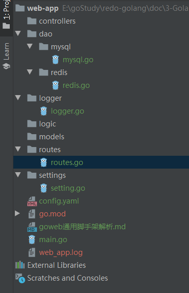

## 0、前言
* 项目目录结构


## 1、main函数
```
package main

import (
	"context"
	"fmt"
	"log"
	"net/http"
	"os"
	"os/signal"
	"syscall"
	"time"
	"web-app/dao/mysql"
	"web-app/logger"
	"web-app/routes"
	"web-app/settings"

	"github.com/spf13/viper"

	"go.uber.org/zap"
)

// Go Web 开发较通用的脚手架

func main() {
	// 加载配置文件
	if err := settings.Init(); err != nil {
		fmt.Printf("init settings failed,err:%v\n", err)
		return
	}
	// 初始化日志
	if err := logger.Init(); err != nil {
		fmt.Printf("init logger failed,err:%v\n", err)
		return
	}
	defer zap.L().Sync()
	zap.L().Debug("zap init success")

	// 初始化MySql连接
	if err := mysql.Init(); err != nil {
		fmt.Printf("init mysql failed,err:%v\n", err)
		return
	}
	defer mysql.Close()

	// 初始化Redis连接
	//if err := redis.Init(); err != nil {
	//	fmt.Printf("init redis failed,err:%v\n", err)
	//	return
	//}
	//defer redis.Close()

	// 注册路由
	r := routes.Setup()

	// 启动服务（优雅关机）
	srv := &http.Server{
		Addr:    fmt.Sprintf(":%d", viper.GetInt("app.port")),
		Handler: r,
	}

	go func() {
		// 开启一个goroutine启动服务
		if err := srv.ListenAndServe(); err != nil && err != http.ErrServerClosed {
			log.Fatalf("listen: %s\n", err)
		}
	}()

	// 等待中断信号来优雅地关闭服务器，为关闭服务器操作设置一个5秒的超时
	quit := make(chan os.Signal, 1) // 创建一个接收信号的通道
	
	// kill 默认会发送 syscall.SIGTERM 信号
	// kill -2 发送 syscall.SIGINT 信号，我们常用的Ctrl+C就是触发系统SIGINT信号
	// kill -9 发送 syscall.SIGKILL 信号，但是不能被捕获，所以不需要添加它
	// signal.Notify把收到的 syscall.SIGINT或syscall.SIGTERM 信号转发给quit
	signal.Notify(quit, syscall.SIGINT, syscall.SIGTERM) // 此处不会阻塞
	
	<-quit                                               // 阻塞在此，当接收到上述两种信号时才会往下执行
	zap.L().Info("Shutdown Server...")
	
	// 创建一个5秒超时的context
	ctx, cancel := context.WithTimeout(context.Background(), 5*time.Second)
	defer cancel()
	// 5秒内优雅关闭服务（将未处理完的请求处理完再关闭服务），超过5秒就超时退出
	if err := srv.Shutdown(ctx); err != nil {
		zap.L().Fatal("Server Shutdown: ", zap.Error(err))
	}
	zap.L().Info("Server exiting")
}
```

## 2、初始化配置文件
* config.yaml文件
```
app:
  name: "web_app"
  mode: "dev"
  port: 8081

log:
  level: "debug"
  filename: "web_app.log"
  max_size: 200
  min_age: 30
  max_backups: 7
mysql:
  host: "127.9.9.1"
  port: 3306
  user: "root"
  password: "123456"
  dbname: "web_app"
  mysql.max_open_conns: 200
  mysql.max_idle_conns: 50
redis:
  host: "127.0.0.1"
  port:
  db: 0
  password: ""
  pool_size: 100
```

* 初始化配置文件（方式一）
```
package settings

import (
	"fmt"

	"github.com/fsnotify/fsnotify"
	"github.com/spf13/viper"
)

func Init() (err error) {
	// 方式一，相对路径/绝对路径
	// 其中相对路径是指相对于.exe文件
	//viper.SetConfigFile("./config.yaml") // 指定配置文件

	//方式二，指定路径和文件名（不加后缀）
	//config.json/config.yaml等等都可以，
	//只要文件名一致，可以多个相同的文件名，但是不同的后缀，先找到谁就是谁，与后面这个SetConfigType无关
	//viper.SetConfigName("config")
	//viper.AddConfigPath(".") // 相对路径

	// 方式三，命令行参数
	// 使用命令行参数实现方式一
	// 注意Init()函数要加上fileName参数
	viper.SetConfigFile(fileName) // 指定配置文件

	// 规定了使用什么格式进行解析
	// 基本搭配远程的配置中心（如etcd），获取字节流之后，使用什么格式进行更新
	// 如果没有搭配远程配置中心，该语句不起作用
	viper.SetConfigType("yaml")
	
	err = viper.ReadInConfig()         // 读取配置信息
	if err != nil {                    // 读取配置信息失败
		panic(fmt.Errorf("Fatal error config file: %s \n", err))
	}
	// 监控配置文件变化
	viper.WatchConfig()
	viper.OnConfigChange(func(in fsnotify.Event) {
		fmt.Printf("配置文件发生修改")
	})
	return
}

```
* 初始化配置文件（方式二）
```
package settings

import (
	"fmt"

	"github.com/fsnotify/fsnotify"
	"github.com/spf13/viper"
)

// 全局变量
var Conf = new(AppConfig)

type AppConfig struct {
	Name         string `mapstructure:"name"`
	Mode         string `mapstructure:"mode"`
	Version      string `mapstructure:"version"`
	Port         int    `mapstructure:"port"`
	*LogConfig   `mapstructure:"log"`
	*MysqlConfig `mapstructure:"mysql"`
	*RedisConfig `mapstructure:"redis"`
}
type LogConfig struct {
	Level      string `mapstructure:"level"`
	FileName   string `mapstructure:"filename"`
	MaxSize    int    `mapstructure:"max_size"`
	MinAge     int    `mapstructure:"min_age"`
	MaxBackups int    `mapstructure:"max_backups"`
}
type MysqlConfig struct {
	Host         string `mapstructure:"host"`
	User         string `mapstructure:"user"`
	Password     string `mapstructure:"password"`
	DbName       string `mapstructure:"db_name"`
	Port         int    `mapstructure:"port"`
	MaxOpenConns int    `mapstructure:"max_open_conns"`
	MaxIdleConns int    `mapstructure:"max_idle_conns"`
}
type RedisConfig struct {
	Host     string `mapstructure:"host"`
	Password string `mapstructure:"password"`
	Port     int    `mapstructure:"port"`
	DB       int    `mapstructure:"db"`
	PoolSize int    `mapstructure:"pool_size"`
}

func Init(fileName string) (err error) {
	// 方式一，相对路径/绝对路径
	// 其中相对路径是指相对于.exe文件
	//viper.SetConfigFile("./config.yaml") // 指定配置文件

	//方式二，指定路径和文件名（不加后缀）
	//config.json/config.yaml等等都可以，
	//只要文件名一致，可以多个相同的文件名，但是不同的后缀，先找到谁就是谁，与后面这个SetConfigType无关
	//viper.SetConfigName("config")
	//viper.AddConfigPath(".") // 相对路径

	// 方式三，命令行参数
	// 使用命令行参数实现方式一
	viper.SetConfigFile(fileName) // 指定配置文件

	// 规定了使用什么格式进行解析
	// 基本搭配远程的配置中心（如etcd），获取字节流之后，使用什么格式进行更新
	// 如果没有搭配远程配置中心，该语句不起作用
	viper.SetConfigType("yaml")

	err = viper.ReadInConfig() // 读取配置信息
	if err != nil {            // 读取配置信息失败
		panic(fmt.Errorf("Fatal error config file: %s \n", err))
	}

	// 将配置信息反序列化到全局变量中
	if err := viper.Unmarshal(Conf); err != nil {
		fmt.Printf("viper.Unmarshal failed,err:%v\n", err)
	}

	// 监控配置文件变化
	viper.WatchConfig()
	viper.OnConfigChange(func(in fsnotify.Event) {
		fmt.Printf("配置文件发生修改")
		// 更新全局变量中
		if err := viper.Unmarshal(Conf); err != nil {
			fmt.Printf("viper.Unmarshal failed,err:%v\n", err)
		}
	})
	return
}

```
* 这样只要将全局变量Conf暴露出去，其他模块（log，mysql，redis）就可以不用对viper进行import了，其他模块就可以这样写：
```
func Init(cfg *settings.LogConfig) (err error) {
	
	// viper读取方式（方式一）
	writeSyncer := getLogWriter(viper.GetString("log.filename"),
		viper.GetInt("log.max_size"),
		viper.GetInt("max_backups"),
		viper.GetInt("log.max_age"),
	)

	// 结构体方式（方式二）
	writeSyncer := getLogWriter(
		cfg.FileName,
		cfg.MaxSize,
		cfg.MaxBackups,
		cfg.MinAge,
	)

	// ...
}
```
* 千万注意，进行反序列化的时候，结构体的标签必须是`mapstructure:"level"`,而不是其他的`json`、`yaml`等等


## 3、初始化日志
```
package logger

import (
	"net"
	"net/http"
	"net/http/httputil"
	"os"
	"runtime/debug"
	"strings"
	"time"

	"github.com/gin-gonic/gin"
	"github.com/natefinch/lumberjack"
	"github.com/spf13/viper"
	"go.uber.org/zap"
	"go.uber.org/zap/zapcore"
)

func Init() (err error) {
	writeSyncer := getLogWriter(viper.GetString("log.filename"),
		viper.GetInt("log.max_size"),
		viper.GetInt("max_backups"),
		viper.GetInt("log.max_age"),
	)
	encoder := getEncoder()
	var l = new(zapcore.Level)
	err = l.UnmarshalText([]byte(viper.GetString("log.level")))
	if err != nil {
		return
	}
	core := zapcore.NewCore(encoder, writeSyncer, l)

	lg := zap.New(core, zap.AddCaller())
	// 替换zap包中全局的logger实例，后续在其他包中只需使用zap.L()调用即可
	zap.ReplaceGlobals(lg)
	return
}

func getEncoder() zapcore.Encoder {
	encoderConfig := zap.NewProductionEncoderConfig()
	encoderConfig.EncodeTime = zapcore.ISO8601TimeEncoder
	encoderConfig.TimeKey = "time"
	encoderConfig.EncodeLevel = zapcore.CapitalLevelEncoder
	encoderConfig.EncodeDuration = zapcore.SecondsDurationEncoder
	encoderConfig.EncodeCaller = zapcore.ShortCallerEncoder
	return zapcore.NewJSONEncoder(encoderConfig)
}

func getLogWriter(filename string, maxSize, maxBackup, maxAge int) zapcore.WriteSyncer {
	lumberJackLogger := &lumberjack.Logger{
		Filename:   filename,
		MaxSize:    maxSize,
		MaxBackups: maxBackup,
		MaxAge:     maxAge,
	}

	return zapcore.AddSync(lumberJackLogger)
}

// GinLogger 接收gin框架默认的日志
func GinLogger() gin.HandlerFunc {
	return func(c *gin.Context) {
		start := time.Now()
		path := c.Request.URL.Path
		query := c.Request.URL.RawQuery
		c.Next()

		cost := time.Since(start)
		zap.L().Info(path,
			zap.Int("status", c.Writer.Status()),
			zap.String("method", c.Request.Method),
			zap.String("path", path),
			zap.String("query", query),
			zap.String("ip", c.ClientIP()),
			zap.String("user-agent", c.Request.UserAgent()),
			zap.String("errors", c.Errors.ByType(gin.ErrorTypePrivate).String()),
			zap.Duration("cost", cost),
		)
	}
}

// GinRecovery recover掉项目可能出现的panic，并使用zap记录相关日志
func GinRecovery(stack bool) gin.HandlerFunc {
	return func(c *gin.Context) {
		defer func() {
			if err := recover(); err != nil {
				// Check for a broken connection, as it is not really a
				// condition that warrants a panic stack trace.
				var brokenPipe bool
				if ne, ok := err.(*net.OpError); ok {
					if se, ok := ne.Err.(*os.SyscallError); ok {
						if strings.Contains(strings.ToLower(se.Error()), "broken pipe") || strings.Contains(strings.ToLower(se.Error()), "connection reset by peer") {
							brokenPipe = true
						}
					}
				}

				httpRequest, _ := httputil.DumpRequest(c.Request, false)
				if brokenPipe {
					zap.L().Error(c.Request.URL.Path,
						zap.Any("error", err),
						zap.String("request", string(httpRequest)),
					)
					// If the connection is dead, we can't write a status to it.
					c.Error(err.(error)) // nolint: errcheck
					c.Abort()
					return
				}

				if stack {
					zap.L().Error("[Recovery from panic]",
						zap.Any("error", err),
						zap.String("request", string(httpRequest)),
						zap.String("stack", string(debug.Stack())),
					)
				} else {
					zap.L().Error("[Recovery from panic]",
						zap.Any("error", err),
						zap.String("request", string(httpRequest)),
					)
				}
				c.AbortWithStatus(http.StatusInternalServerError)
			}
		}()
		c.Next()
	}
}

```
* `GinLogger()`、`GinRecovery()`用来重新编写了`gin.Default()`里面`Use()`默认两个中间件，不使用他原生的，而使用zap日志库

## 4、初始化Mysql连接
```
package mysql

import (
	"fmt"

	"go.uber.org/zap"

	_ "github.com/go-sql-driver/mysql"
	"github.com/jmoiron/sqlx"
	"github.com/spf13/viper"
)

var db *sqlx.DB

func Init() (err error) {
	dsn := fmt.Sprintf("%s:%s@tcp(%s:%d)/%s?charset=utf8mb4&parseTime=True",
		viper.GetString("mysql.user"),
		viper.GetString("mysql.password"),
		viper.GetString("mysql.host"),
		viper.GetInt("mysql.port"),
		viper.GetString("mysql.dbname"),
	)
	// 也可以使用MustConnect连接不成功就panic
	db, err = sqlx.Connect("mysql", dsn)
	if err != nil {
		zap.L().Error("connect DB failed", zap.Error(err))
		return
	}
	db.SetMaxOpenConns(viper.GetInt("mysql.max_open_conns"))
	db.SetMaxIdleConns(viper.GetInt("mysql.max_idle_conns"))
	return
}

func Close() {
	_ = db.Close()
}

```

## 5、初始化redis连接
```
package redis

import (
	"fmt"

	"github.com/go-redis/redis"
	"github.com/spf13/viper"
)

// 声明一个全局的rdb变量
var rdb *redis.Client

// 初始化连接
func Init() (err error) {
	rdb = redis.NewClient(&redis.Options{
		Addr: fmt.Sprintf("%s:%d",
			viper.GetString("redis.host"),
			viper.GetInt("redis.port")),
		Password: viper.GetString("redis.password"), // no password set
		DB:       viper.GetInt("redis.db"),          // use default DB
		PoolSize: viper.GetInt("redis.pool_size"),
	})

	_, err = rdb.Ping().Result()
	return
}

func Close() {
	_ = rdb.Close()
}

```

## 6、初始化路由
```
package routes

import (
	"net/http"
	"web-app/logger"

	"github.com/gin-gonic/gin"
)

// 相当于重写了gin.Default()
func Setup() (r *gin.Engine) {
	r = gin.New()
    
	r.Use(logger.GinLogger(), logger.GinRecovery(true))
	r.GET("/", func(context *gin.Context) {
		context.String(http.StatusOK, "ok")
	})
	return
}
```

## 7、启动服务（优雅关机）
```
        srv := &http.Server{
		Addr:    fmt.Sprintf(":%d", viper.GetInt("app.port")),
		Handler: r,
	}

	go func() {
		// 开启一个goroutine启动服务
		if err := srv.ListenAndServe(); err != nil && err != http.ErrServerClosed {
			log.Fatalf("listen: %s\n", err)
		}
	}()

	// 等待中断信号来优雅地关闭服务器，为关闭服务器操作设置一个5秒的超时
	quit := make(chan os.Signal, 1) // 创建一个接收信号的通道

	// kill 默认会发送 syscall.SIGTERM 信号
	// kill -2 发送 syscall.SIGINT 信号，我们常用的Ctrl+C就是触发系统SIGINT信号
	// kill -9 发送 syscall.SIGKILL 信号，但是不能被捕获，所以不需要添加它
	// signal.Notify把收到的 syscall.SIGINT或syscall.SIGTERM 信号转发给quit
	signal.Notify(quit, syscall.SIGINT, syscall.SIGTERM) // 此处不会阻塞

	<-quit // 阻塞在此，当接收到上述两种信号时才会往下执行
	zap.L().Info("Shutdown Server...")

	// 创建一个5秒超时的context
	ctx, cancel := context.WithTimeout(context.Background(), 5*time.Second)
	defer cancel()
	// 5秒内优雅关闭服务（将未处理完的请求处理完再关闭服务），超过5秒就超时退出
	if err := srv.Shutdown(ctx); err != nil {
		zap.L().Fatal("Server Shutdown: ", zap.Error(err))
	}
	zap.L().Info("Server exiting")
```