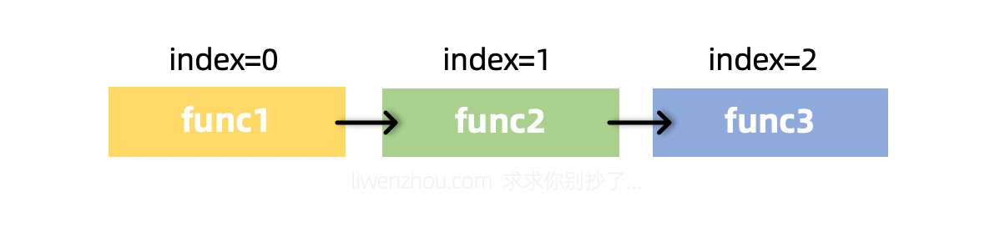
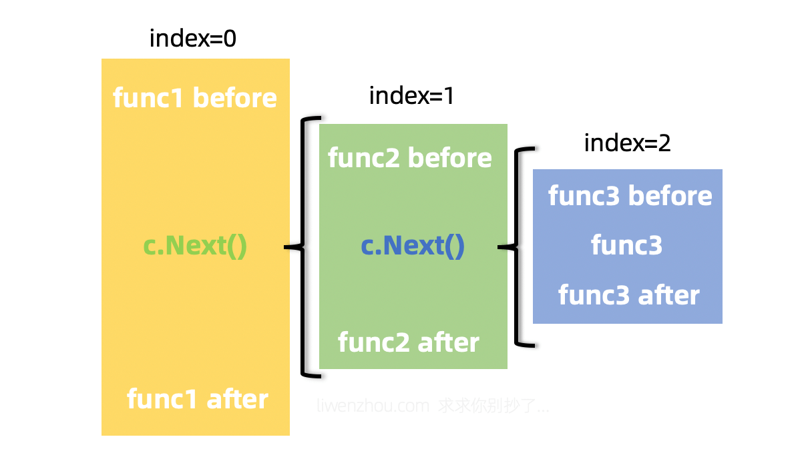
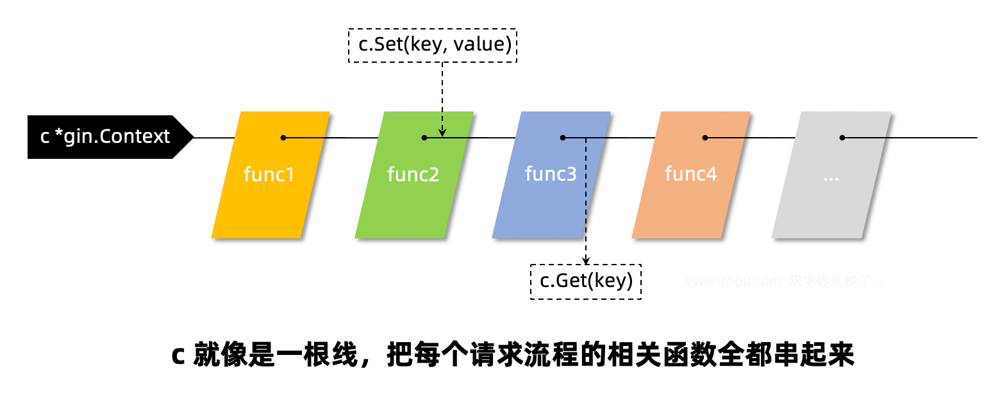

## 1、前言
* gin框架涉及中间件相关有4个常用的方法，它们分别是c.Next()、c.Abort()、c.Set()、c.Get()

## 2、中间件注册的过程
* 从我们最常用的r := gin.Default()的Default函数开始看，它内部构造一个新的engine之后就通过Use()函数注册了Logger中间件和Recovery中间件
```
// r := gin.Default()，初始化r
func Default() *Engine {
    debugPrintWARNINGDefault()
    engine := New()

    // 重点阅读Use()
    engine.Use(Logger(), Recovery())
    return engine
}
```
* 继续往下查看一下Use()函数的代码
```
func (engine *Engine) Use(middleware ...HandlerFunc) IRoutes {
    // 实际上还是调用的RouterGroup的Use函数
    // 在gin路由源码中可知，RouterGroup是嵌在Engine里面的
    engine.RouterGroup.Use(middleware...)  

    engine.rebuild404Handlers()
    engine.rebuild405Handlers()
    return engine
}

//实际就是增加再原来的中间件函数后面
//这里原来的中间件函数指的是，在group已经注册过的中间件函数
func (group *RouterGroup) Use(middleware ...HandlerFunc) IRoutes {
	group.Handlers = append(group.Handlers, middleware...)
	return group.returnObj()
}
```
* 这个append是不是很熟悉？他的思想，就是我们注册路由时，拓展的自定义处理函数
> 其实，我们自定义的处理函数，也是中间件，不过是最后一个中间件罢了
```
func (group *RouterGroup) handle(httpMethod, relativePath string, handlers HandlersChain) IRoutes {
	absolutePath := group.calculateAbsolutePath(relativePath)

    //增加用户定义的处理函数
	handlers = group.combineHandlers(handlers)

    //很重要，但是不是这次阅读的重点
    //gin路由的源码解析中，有重点解析
	group.engine.addRoute(httpMethod, absolutePath, handlers)
	return group.returnObj()
}

//这里的abortIndex和后面的Abort不要混淆了
//这里的abortIndex作用：只是防止合并处理函数时，数量过多的情况
//后面的abortIndex作用：Abort()执行之后，停止执行后面的的中间件函数，原地停止
func (group *RouterGroup) combineHandlers(handlers HandlersChain) HandlersChain {
	finalSize := len(group.Handlers) + len(handlers)
	if finalSize >= int(abortIndex) {
		panic("too many handlers")
	}
	mergedHandlers := make(HandlersChain, finalSize)
	copy(mergedHandlers, group.Handlers)
	copy(mergedHandlers[len(group.Handlers):], handlers)
	return mergedHandlers
}
```
* 也就是说，我们会将一个路由的中间件函数和处理函数结合到一起组成一条处理函数链条HandlersChain，而它本质上就是一个由HandlerFunc组成的切片
```
type HandlersChain []HandlerFunc
```
## 3、中间件的执行
#### 3-1 前言

* 在gin路由源码解析中，路由匹配中有下面的代码
```
func (engine *Engine) handleHTTPRequest(c *Context) {
    // ...  

    t := engine.trees
    for i, tl := 0, len(t); i < tl; i++ {
        if t[i].method != httpMethod {
            continue
        }
        root := t[i].root

        value := root.getValue(rPath, c.params, c.skippedNodes, unescape)

        if value.handlers != nil {
            c.handlers = value.handlers
            c.fullPath = value.fullPath
            c.Next() //执行函数链条
            c.writermem.WriteHeaderNow()
            return
        }
        // ...
    }
    // ...
}
```
#### 3-2 Next和Abort源码解析
##### 3-2-1 c.Next()
* c.Next()，中间件函数的执行，是传递一个公用的`*Context`指针，意味着对于index的更改是永久性的，不管在哪里更改了index，就永久更改了，不存在副本
```
func (c *Context) Next() {
	c.index++
	for c.index < int8(len(c.handlers)) {
		c.handlers[c.index](c)
		c.index++
	}
}
```
* 怎么理解**永久更改**,先看下面的的main.go
```

func fun1(c *gin.Context){
    fmt.Println("fun1 start")
    fmt.Println("fun1 end")
}
func fun2(c *gin.Context){
    fmt.Println("fun2 start")
    fmt.Println("fun2 end")
}
func fun3(c *gin.Context){
    fmt.Println("fun3 start")
    fmt.Println("fun3 end")
}
func fun4(c *gin.Context){
    fmt.Println("fun4 start")
    fmt.Println("fun4 end")
}

func main(){
    r := gin.Default()  
       
    group1 := r.Group("/group1",fun1)
    group1.Use(fun2)
    {
    	group1.GET("/get",fun3,fun4)
    }

    r.Run(":9090")
}

//执行结果
fun1 start
fun1 end
fun2 start
fun2 end
fun3 start
fun3 end
fun4 start
fun4 end
```
* 以上代码的执行过程，类似
    
* 现在对fun2做点更改，可以看到，就不是顺序调用中间件了，而是从fun2
开始出去，顺序调用fun3、fun4，之后再回来执行fun2
```
func fun2(c *gin.Context){
    fmt.Println("fun2 start")   
    
    // 由fun2执行Next
    c.Next()

    fmt.Println("fun2 end")
}

// 执行结果
fun1 start
fun1 end
fun2 start
fun3 start
fun3 end
fun4 start
fun4 end
fun2 end
```
* 以上代码的执行过程，类似
    
##### 3-2-2 c.Abort()
* 现在对fun3调用Abort(),可以看到，fun3执行完成之后，fun4是不会执行的
```
func fun3(c *gin.Context){
    fmt.Println("fun3 start")

    // 由fun3执行Abort
    c.Abort()
	
    fmt.Println("fun3 end")
}

// 执行结果
fun1 start
fun1 end
fun2 start
fun3 start
fun3 end
fun2 end
```
* Abort源码，十分简单,对比Next源码就知道了
```
//Abort
func (c *Context) Abort() {

    // 将函数指针赋值最大，在Next函数中，for遍历时，直接退出for循环
    c.index = abortIndex
}

//Next
func (c *Context) Next() {
    c.index++
    for c.index < int8(len(c.handlers)) {
        c.handlers[c.index](c)
        c.index++
    }
}
```
* **总结**：由于中间件的函数所需要参数是指针，所以`c.index`在任何一个中间件中更改都会永久生效

#### 3-3 c.Get()/c.Set()
##### 3-3-1 前言
* c.Set()和c.Get()这两个方法多用于在多个函数之间通过c传递数据的:
  * 比如我们可以在认证中间件中获取当前请求的相关信息（userID等）通过c.Set()存入c
  * 然后在后续处理业务逻辑的函数中通过c.Get()来获取当前请求的用户
* 这个过程，类似
    

##### 3-3-2 c.Set()源码
```
// 可以看到，仍然是使用指针*Context，永久更改Keys
func (c *Context) Set(key string, value interface{}) {
    c.mu.Lock()
    if c.Keys == nil {
        c.Keys = make(map[string]interface{})
    }   
    c.Keys[key] = value
    c.mu.Unlock()
}

// Keys的定义
Keys map[string]interface{}
```
##### 3-3-3 c.Get()源码
```
func (c *Context) Get(key string) (value interface{}, exists bool) {
    c.mu.RLock()
    value, exists = c.Keys[key]
    c.mu.RUnlock()
    return
}
```
##### 3-3-4 应用
* 更改之前的fun2、fun3
```
func fun2(c *gin.Context){
    fmt.Println("fun2 start")
    c.Set("key","val")
    fmt.Println("fun2 end")
}
func fun3(c *gin.Context){
    fmt.Println("fun3 start")
    val,ok := c.Get("key")
    if ok {
        fmt.Println(val.(string))
    }
    fmt.Println("fun3 end")
}

// 执行结果
fun1 start
fun1 end
fun2 start
fun2 end
fun3 start
val
fun3 end
fun4 start
fun4 end
```
  
