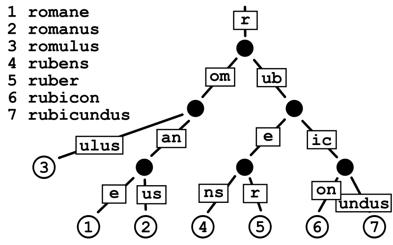

## 1、一个基础的基于gin网络服务的代码
```
package main
import (
    "github.com/gin-gonic/gin"
    "net/http"
)
func main(){
    r := gin.Default()
    r.GET("hello", func(context *gin.Context) {
    	context.JSON(http.StatusOK,"hello")
    })
    r.Run(":9090")
}
```
## 2、Radix Tree

#### 2-1 Run()做了什么事情
```
func (engine *Engine) Run(addr ...string) (err error) {
    //...
    err = http.ListenAndServe(address, engine)
    return
}

func ListenAndServe(addr string, handler Handler) error {
    server := &Server{Addr: addr, Handler: handler}
    return server.ListenAndServe()
}

//现在先停下来，不深入下去，等待阅读完net/http源码之后，再回来补充
```

#### 2-2 gin根据方法类型来组织树
* gin其路由的原理是基数树（Radix Tree）是一种更节省空间的前缀树（Trie Tree）。对于基数树的每个节点，如果该节点是唯一的子树的话，就和父节点合并

* 上一小节中，查看ListenAndServe的Handler可知，要求Engine实现ServeHTTP函数
```
func (engine *Engine) ServeHTTP(w http.ResponseWriter, req *http.Request) {
    //提高gc的效率，取出后再初始化
    c := engine.pool.Get().(*Context)
    c.writermem.reset(w)
    c.Request = req
    c.reset() 

    //重点阅读，处理req
    engine.handleHTTPRequest(c) 

    //使用完成之后回收
    engine.pool.Put(c)
}

func (engine *Engine) handleHTTPRequest(c *Context) {
    //...
    //根据httpMethod寻找对应的树
    t := engine.trees
    for i, tl := 0, len(t); i < tl; i++ {
        if t[i].method != httpMethod {
    	    continue
    	}
        //todo
    }
    //...
}
```
* 由上面可以知道，由于URL路径具有层次结构，并且只使用有限的一组字符(字节值)，所以很可能有许多常见的前缀。这使我们可以很容易地将路由简化为更小的问题。此外，**路由器为每种请求方法管理一棵单独的树**。好处一，它比在每个节点中都保存一个Map（method，handle）更加节省空间，组织情况如下面所示
```
r := gin.Default()
r.GET("/", func1)
r.GET("/search/", func2)
r.GET("/support/", func3)
r.GET("/blog/", func4)
r.GET("/blog/:post/", func5)
r.GET("/about-us/", func6)
r.GET("/about-us/team/", func7)
r.GET("/contact/", func8)

Priority   Path             Handle
9          \                *<1>
3          ├s               nil
2          |├earch\         *<2>
1          |└upport\        *<3>
2          ├blog\           *<4>
1          |    └:post      nil
1          |         └\     *<5>
2          ├about-us\       *<6>
1          |        └team\  *<7>
1          └contact\        *<8>
```
* 另一个好处，例如：blog/:post其中:post只是实际文章名称的占位符(参数)。与hash-maps不同，这种树结构还允许我们使用像:post参数这种动态部分，因为我们实际上是根据路由模式进行匹配，而不仅仅是比较哈希值

* 为了获得更好的可伸缩性，每个树级别上的子节点都按Priority(优先级)排序，其中优先级（最左列）就是在子节点(子节点、子子节点等等)中注册的句柄的数量。这样做有两个好处:
  * 首先优先匹配被大多数路由路径包含的节点。这样可以让尽可能多的路由快速被定位。
  * 类似于成本补偿。最长的路径可以被优先匹配，补偿体现在最长的路径需要花费更长的时间来定位，如果最长路径的节点能被优先匹配（**即每次拿子节点都命中**），那么路由匹配所花的时间不一定比短路径优先的路由长。下面展示了节点（每个-可以看做一个节点）匹配的路径：从左到右，从上到下。
    ```
    ├------------
    ├---------
    ├-----
    ├----
    ├--
    ├--
    └-
    ```
#### 2-3 get底层的调用过程
* r.get做了什么
```
r.GET("hello", func(context *gin.Context) {
    context.JSON(http.StatusOK,"hello")
})
//r明明是*Engine类型，为什么这里调用者是*RouterGroup,马上讲到
func (group *RouterGroup) GET(relativePath string, handlers ...HandlerFunc)IRoutes {
    return group.handle(http.MethodGet, relativePath, handlers)
}
```
* RouterGroup是什么
```
//Engine可以理解为RouterGroup的子类

type Engine struct {
    RouterGroup
    //...
}
```
* 一些小细节
```
//为什么要这样写
//虽然_变量没有使用到，但是这一句话确保了Engine实现了IRouter接口
//将问题暴露再编译阶段
var _ IRouter = &Engine{}
```
* 继续讨论get
```
func (group *RouterGroup) GET(relativePath string, handlers ... HandlerFunc)IRoutes {
    return group.handle(http.MethodGet, relativePath,   handlers)
}
func (group *RouterGroup) handle(httpMethod, relativePath   string, handlersHandlersChain) IRoutes {
    //路由有分组的会，重新计算url，要加上group.basePath
    absolutePath := group.calculateAbsolutePath(relativePath)
    
    //组合原生的方法和新添加的方法
    handlers = group.combineHandlers(handlers)
    //重点阅读，添加路由
    group.engine.addRoute(httpMethod, absolutePath, handlers)
    return group.returnObj()
}
func (group *RouterGroup) combineHandlers(handlers HandlersChain) HandlersChain {
    finalSize := len(group.Handlers) + len(handlers)
    if finalSize >= int(abortIndex) {
        panic("too many handlers")
    }
    
    mergedHandlers := make(HandlersChain, finalSize)
    
    //复制两个Handlers，组合成为新的
    copy(mergedHandlers, group.Handlers)
    copy(mergedHandlers[len(group.Handlers):], handlers)
    
    return mergedHandlers
}
func (engine *Engine) addRoute(method, path string, handlers HandlersChain) {
    //...
    // 获取请求方法对应的树
    root := engine.trees.get(method)
    if root == nil {
        // 如果没有就创建一个
	    root = new(node)
	    root.fullPath = "/"
	    engine.trees = append(engine.trees, methodTree{method: method, root: root)
    }  
    //2-4重点阅读
    root.addRoute(path, handlers)
    //...
}
//再一次证明，gin是按照方法来组织树的
func (trees methodTrees) get(method string) *node {
    for _, tree := range trees {
        if tree.method == method {
            return tree.root
        }
    }
    return nil
}
```
* 继续深入讨论，为什么使用切片而不是map来存储请求方法->树的结构
    * 出于节省内存的考虑吧，毕竟HTTP请求方法的数量是固定的，而且常用的就那几种，所以即使使用切片存储查询起来效率也足够了。顺着这个思路，我们可以看一下gin框架中engine的初始化方法中，确实对tress字段做了一次内存申请
    ```
    func New() *Engine {
	    debugPrintWARNINGNew()
	    engine := &Engine{
		    RouterGroup: RouterGroup{
			    Handlers: nil,
			    basePath: "/",
			    root:     true,
		    },
		    //...
		    // 初始化容量为9的切片（HTTP1.1请求方法共9种）
		    trees: make(methodTrees, 0, 9),
		    //...
	    }
	    engine.RouterGroup.engine = engine
	    engine.pool.New = func() interface{} {
		    return engine.allocateContext()
	    }
	    return engine
    }
    ```

#### 2-4 get语句之后，实现路由树过程
* 节点
```
type node struct {
    // 节点路径，比如上面的s，earch，和upport
    path string

    // 和children字段对应, 保存的是分裂的分支的第一个字符
    // 例如search和support, 那么s节点的indices对应的"eu"
    // 代表有两个分支, 分支的首字母分别是e和u
    indices   string

    // 儿子节点
    children  []*node
    
    // 处理函数链条（切片）
    handlers  HandlersChain

    // 优先级，子节点、子子节点等注册的handler数量
    // 后代越多，优先级越低
    priority  uint32
    
    // 节点类型，包括static, root, param, catchAll
    // static: 静态节点（默认），比如上面的s，earch等节点
    // root: 树的根节点
    // catchAll: 有*匹配的节点
    // param: 参数节点
    nType     nodeType
    
    // 节点是否是参数节点，比如上面的:post
    wildChild bool
    
    // 完整路径
    fullPath  string
}
```
* addRoute
```
// addRoute 将具有给定句柄的节点添加到路径中。
// 不是并发安全的
func (n *node) addRoute(path string, handlers HandlersChain) {
    fullPath := path
    n.priority++
    // 空树就直接插入当前节点
    if len(n.path) == 0 && len(n.children) == 0 {
        n.insertChild(path, fullPath, handlers)
        n.nType = root
        return
    }
    parentFullPathIndex := 0
walk:
    for {
        // 找到最长的通用前缀
        // 这也意味着公共前缀不包含“:”"或“*” 
        // 因为现有键不能包含这些字符。
        i := longestCommonPrefix(path, n.path)
        // 分裂边缘（此处分裂的是当前树节点），后续（下一个if）会添加下来的节点
        // 例如一开始path是search，新加入support，s是他们通用的最长前缀部分
        // 那么会将s拿出来作为parent节点，增加earch和upport作为child点                
        if i < len(n.path) {
            child := node{
                //这个child是原来拆分出来的，不是新来的
            	path:      n.path[i:], 
                wildChild: n.wildChild,
                indices:   n.indices,
                children:  n.children,
                handlers:  n.handlers,
                //子节点优先级-1，因为之前++过了
                priority:  n.priority - 1, 
                fullPath:  n.fullPath,
            }
            //先添加一个孩子	
            n.children = []*node{&child} 
            
            //孩子的第一个char，其实是失配的第一个，共同的前都属于n了
            //这只是先添加一个，后面还会添加	
            n.indices = bytesconv.BytesToString([]byte{n.path[i]})
            
            n.path = path[:i]
            n.handlers = nil
            n.wildChild = false
            n.fullPath = fullPath[:parentFullPathIndex+i]
        }
        // 将新来的节点插入新的parent节点作为子节点
        if i < len(path) {
            //截取非公共的部分作为新节点的path
        	path = path[i:]
        	c := path[0]            
        	
            // 处理参数后加斜线情况
        	if n.nType == param && c == '/' && len(n.children) == 1 {
        	    parentFullPathIndex += len(n.path)
        	    n = n.children[0]
        	    n.priority++
        	    continue walk
            }
            // 检查路path下一个字节的子节点是否存在
            // 比如s的子节点现在是earch和upport，indices为eu
            // 如果新加一个路由为super，那么就是和upport有匹配的部分u，将继续分列在upport节点
        	for i, max := 0, len(n.indices); i < max; i++ {
                if c == n.indices[i] {
                    parentFullPathIndex += len(n.path)
                    i = n.incrementChildPrio(i)
                    //继续分裂upport节点
                    n = n.children[i]
                    continue walk
                }
            }
        	// 否则就插入
        	if c != ':' && c != '*' && n.nType != catchAll {
                // []byte for proper unicode char conversion, see #65
                n.indices += bytesconv.BytesToString([]byte{c})
                child := &node{
                	fullPath: fullPath,
                }
                n.addChild(child)
                n.incrementChildPrio(len(n.indices) - 1)
                n = child
        	} else if n.wildChild { // 如果是参数节点
                
                // inserting a wildcard node, need to check if it 
                // conflicts with the existing wildcard
                n = n.children[len(n.children)-1]
                n.priority++                    
                
                // 检查通配符是否匹配
                if len(path) >= len(n.path) && n.path == path[:len(n.path)] &&
                    // Adding a child to a catchAll is not possible
                    n.nType != catchAll &&
                    // Check for longer wildcard, e.g. :name and :names
                    (len(n.path) >= len(path) || path[len(n.path)] == '/') {
                    continue walk
                }
                // Wildcard conflict
                pathSeg := path
                if n.nType != catchAll {
                	pathSeg = strings.SplitN(pathSeg, "/", 2)[0]
                }
                prefix := fullPath[:strings.Index(fullPath, pathSeg)] + n.path
                panic("'" + pathSeg +
                	"' in new path '" + fullPath +
                	"' conflicts with existing wildcard '" + n.path +
                	"' in existing prefix '" + prefix +
                	"'")
                }
            }
        	n.insertChild(path, fullPath, handlers)
        	return
        } 
        // 已经注册过的节点
        if n.handlers != nil {
            panic("handlers are already registered for path '" + fullPath +"'")
        }
        n.handlers = handlers
        n.fullPath = fullPath
        return
    }
}
```
* 以上代码总结
    * 第一次注册路由，例如注册search
    * 继续注册一条没有公共前缀的路由，例如blog
    * 注册一条与先前注册的路由有公共前缀的路由，例如support 
    

* insertChild
```
//todo 有时间 补充
```
#### 2-5 路由匹配
* 从路由树中寻找对应的节点
```
func (engine *Engine) ServeHTTP(w http.ResponseWriter, req *http.Request) {
    //提高gc的效率，取出后再初始化
    c := engine.pool.Get().(*Context)
    c.writermem.reset(w)
    c.Request = req
    c.reset() 

    //重点阅读，处理req
    engine.handleHTTPRequest(c) 

    //使用完成之后回收
    engine.pool.Put(c)
}

func (engine *Engine) handleHTTPRequest(c *Context) {
    //...   
    // 根据请求方法找到对应的路由树
    t := engine.trees
    for i, tl := 0, len(t); i < tl; i++ {
        if t[i].method != httpMethod {
            continue
        }
        root := t[i].root

        // 在路由树中根据path查找
        value := root.getValue(rPath, c.params, c.skippedNodes, unescape)

        if value.handlers != nil {
            c.handlers = value.handlers
            c.fullPath = value.fullPath
            c.Next()
            c.writermem.WriteHeaderNow()
            return
        }
        //...
    }
    //...
    c.handlers = engine.allNoRoute
    serveError(c, http.StatusNotFound, default404Body)
}

//路由匹配是由节点的 getValue方法实现的
//getValue根据给定的路径(键)返回nodeValue值，保存注册的处理函数和匹配到的路径参数数据
func (n *node) getValue(path string, params *Params, skippedNodes *[]skippedNode, unescape bool) (value nodeValue){}

//返回值结构体
type nodeValue struct {
    handlers HandlersChain
    params   Params  // []Param
    tsr      bool
    fullPath string
}
```

* getValue
  ```
  //todo 有时间 补充
  ```