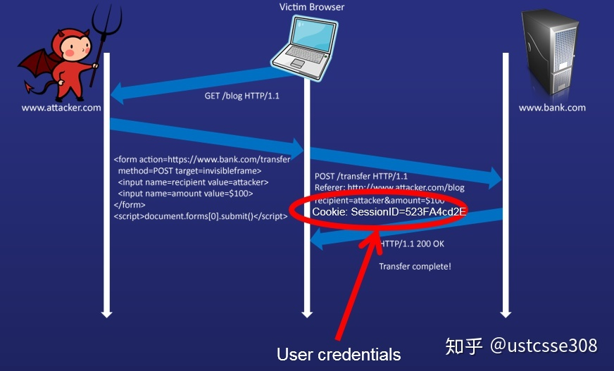

## 1、案例
* 作为普通用户Alice，首先登录了我们的zoobar网站，在这个网站上看看朋友的profile，转两个bar给好朋友Cindy，另一个好朋友Diana又转给她3个。然后她发现了有个用户Bob的profile中写了一个非常引人注意的URL，是一个萌猫网站。于是Alice很开心地点进去了，看了一会儿猫咪之后，她关掉了浏览器，完全没有注意到自己的bar已经少了。

## 2、原理
* CSRF是Cross-Site Request Forgery的简称，就是跨站请求伪造。这次课我们就好好理解一下这个攻击是怎么回事。在上面的演示中，Alice是通过攻击者Bob的链接点击到了攻击网站，实际上，即使Alice首先关闭了页面或者浏览器，只要她没有点击退出网站，或者只要她的cookie还没有过期，那么她访问攻击者网站的时候，她的zoobar就会被偷走。
为了理清楚，我们得从头开始看看转发zoobar的过程。在普通用户看来，zoobar网站提供了转账功能，是为了促进朋友感情的，我自己可以选择给哪个好朋友转多少bar，除了我自己外谁也不能转。但是，从服务器的角度来看，这个transfer的过程是怎么样的？

* 结合网站的代码，我们可以发现，zoobar网站的transfer页面上，有一个表单，表单的action目标是transfer.php，然后表单中有几个项，分别是转给谁，转多少。那网站是怎么判断是谁要转bar给其他人的呢？Alice登录之后，网站就给她设了一个cookie，然后Alice每次请求一个新网页的时候，浏览器都会自动把cookie带上，帮助网站识别Alice。网站在接收到请求和Cookie之后，就进行一下数据库操作，把Alice对应的bar的个数减掉两个，把Cindy对应的个数加上两个。

* 这里我们要再强调一遍，因为cookie非常重要，所以浏览器对Cookie的必要保护是有的。它会自动判断当前网页请求的URL，会根据cookie所属的URL判断发送哪个cookie过去。譬如Alice如果在zoobar网站，然后访问到恶意网址，绝对不会出现说，恶意网址可以拿到Alice的zoobar网站cookie的情况。
  
* 也就是说，不是攻击者Bob先想办法从浏览器中骗到了Alice的Cookie，在这个实验中，攻击者没办法做到这一点。但是，攻击者仍然可以利用到Alice的cookie来完成偷窃。

* CSRF攻击是通过利用浏览器来完成的。为了维持HTTP协议和网站的正常运行，浏览器不得不每次访问网站的时候都主动的携带上自己保存的相应网站的cookie。所以，攻击者所要做的，就是主动发出去一个对目标网站的请求就可以了。这就是该攻击名字的由来——跨站请求“伪造”。本来应该是用户自己主动的行为发出请求，却被攻击者伪造了。

* 只要用户当前浏览器中还保留着目标网站如Zoobar（银行）的cookie，然后又浏览了恶意攻击网站，而攻击网站又主动发出了对目标网站的请求，浏览器就会主动地携带上目标网站的Cookie。目标网站很难区分这个请求到底是目标网站发出来的，还是攻击者发出来的。所以，有一条安全规则是：当完成网站使用后，请点击登出网站，而不是直接点右上角的×，因为登出会销毁Cookie。

* 理解了原理之后，我们来看看这个攻击的代码实现。CSRF攻击实现的主要事项是伪造这个请求。有很多种方法可以实现。首先，攻击者要伪造这个请求，必须知道zoobar网站发给服务器的请求长什么样。这个怎么知道呢？答案很简单，只要注册进入网站，这个请求是前端发送过去的，右键查看源代码，在页面上一清二楚。
```
<form method=POST name=transferform
  action="/transfer.php">
 
<p>Send <input name=zoobars type=text value="" size=5> zoobars</p>
<p>to <input name=recipient type=text value=""></p>
<input type=submit name=submission value="Send">
</form>
```


* 所以，攻击者只要将以上transfer的页面上的表单代码拷贝一下，放到自己的网站上就可以了。
> **相对而言，如果使用GET方法提供表单确实要更简单一点，只需要构造一个URL，诱导受害者去点击就行了。不过即使使用POST，攻击者也同样可以伪造**

* 此时的攻击者网页大概长的和转账页面一样；用户当然不会傻到要在攻击者网站填上要发给attacker自己的钱物。但是没关系，攻击者可以自己写页面，把值默认填好；攻击者也不会傻到要去点击send按钮。但是攻击者绕过这一点的方法多得是。攻击者可以把按钮上的文字描述改一下，改成“点击赢大奖”，“点击赢华为Mate20”等，各位会不会有兴趣去点一下？

* 估计讲到这里，大家心里正在默默地下决心，以后打开不常用网站的网页，不管什么按钮我都不点。这个是很好的，但是足够有用吗？很可惜的是，只有这一点，还不够防御CSRF。因为之前我们在介绍JS的时候说过，JS可以控制页面是所有的内容，包括表单。也即，攻击者在自己的攻击页面上写上表单之后，完全可以自行提交。也即，只要打开页面，这个表单就提交了，浏览器还很贴心地附上了用户的cookie。

## 3、原理图示

* 理解：黑客发来的html和官方发来的html没有有什么区别？没有，用户都可以submit，只要是从用户浏览器发出去的请求，服务器就可以处理（cookie是根据浏览器决定的）

## 4、解决方法
#### 4-1、refer cookie
* 如果不是让浏览器来自动检查，程序员写网站的时候顺带检查一下行不行？从代码角度而言，绝对是没问题的。因为正如在之前看过的，用户发出的HTTP请求中有Referer这一项，就是表示当前的请求是从哪个网站发出去的。这样，只需要使用代码来检查一下就行。譬如这样：
```
<script>
      if((document.referrer.indexOf('localhost')<0) && (document.referrer.indexOf('zoobar.com')<0)){
              alert(document.referrer);
              document.location = "http://www.baidu.com";
              top.location = document.location;
                
}
</script>
```
* 我们给大家演示一下就明白了，这种方法只是看起来很美好。

* 为啥嘞？因为用户请求从浏览器发出去之前，浏览器可以对它做各种修改。其中有一种，作为对自己隐私非常介意的用户，可能会主动设置自己的浏览器在发出请求的时候不带Referrer这个选项。现在的浏览器可以很容易控制不发送referfer。在浏览器URL中输入about:config；然后在search中输入referer；可以找到
  * 0 – Disable referrer.
  * 1 – Send the Referer header when clicking on a link, and set document.referrer for the following page.
  * 2 – Send the Referer header when clicking on a link or loading an image 

#### 4-2、验证码
* 这种方法是强制用户在转账之前必须进行交互，也即需要一个验证码，这对于银行转账而言还是非常重要的。但是考虑到用户体验友好，不能给所有的操作都加上验证码。因此验证码只能作为一种辅助手段，不能作为主要解决方案。【即使有验证码，当骗子的目光集中到验证码的时候，连验证码都能骗走。】

#### 4-3、Anti CSRF Token

* 攻击者能够攻击成功，一方面是浏览器热心发送了cookie，一方面是攻击者很容易伪造请求。那有没有可能让攻击者不能伪造请求？给攻击者的请求伪造设置门槛？这个防御思路，把改进的方向调整到了网站本身。CSRF攻击能够成功，是因为请求太容易伪造了；如果请求中包括一些攻击者不能容易获取的信息，那么攻击自然不能成功。当然，网页本身还是所有人可见的，那么就需要让其中的信息难以简单复制。换言之，我们需要在表单中添加一些信息，这个信息最好是用户独特而且快速变化的，这样攻击者及时能看到一个人的信息，他也不能伪造其他人的；及时他获得了其他人的信息，但是这个信息快速变化，短时间不用便会过期。另外，添加这样的信息最好不要影响正常用户的使用，维持用户友好。

* 幸好，这样的事情其实很容易做到。现在业界对CSRF的防御，就是这个思路，使用一个Token（Anti CSRF Token）。

* 用户登录网站，服务端生成一个Token，放在用户的Session
在页面表单附带上Token参数，为了不影响用户，可以设置type=hidden
用户提交请求时，表单中的这一参数会自动提交， 服务端验证表单中的Token是否与用户Session中的Token一致，一致为合法请求，不是则非法请求
每次提交，token值可以更新
因为这个Token值是每个用户不同，并且开发人员可以设置粒度，用户每次登录不同，还是每次提交不同，这样彻底使得攻击者无法伪造请求。

最终的页面可能长这个样子：
```
<form method=POST name=transferform   action="/transfer.php">
 
<input name=token type=hidden value="09d6dde682f36904cd58e43cd0e03d59">
<p>Send <input name=zoobars type=text value="" size=5> zoobars</p>
<p>to <input name=recipient type=text value=""></p>
<input type=submit name=submission value="Send">
</form>
```

* 在合法的网站上提交请求的时候，带的参数如上；因为攻击者无法获得每个用户每次的token值，所以攻击失败。
* **这就使得，黑客发给用户的html于服务器的html不同了，浏览器可以标识，到底是不是从官方给的html表单来发送请求的，就算黑客抄袭代码，token值也与用户不一样了**
  
## 5、可能的破解方法
#### 5-1 方法介绍
* 在攻击者网站中，构建一个网页，这个网页中有一个iframe框，这个iframe中有zoobar网站的transfer页面，并且作为用户提交transfer请求的target。虽然在外部网页的csrf攻击可能不成功，因为构造不出来token。但是在iframe中可以诱使用户去点击提交，因为这个iframe中的transfer就是网站本身的页面，因此，肯定可以成功。也因此，CSRF防御不成功，并且可以使用CSS的方式，将Iframe的内容不可见，诱使用户点击的招式也和CSRF差不多。

#### 5-2 该方案的分析
* 最明显的，CSRF攻击，使用隐藏token的方法是可以防御的；这个明显防御不了；CSRF不需要使用iframe，这个需要；CSRF可以更隐蔽一些，一旦用户访问页面，攻击就成功了；这个攻击可以做到这一点吗？如下面所示

```
// 可以修改myIFrame
<iframe id='myIFrame' src = 'x1.html' onload="fun1()"></iframe>

<p id='2'>I am 2.html.</p>
<p id='p'>hello world.</p>

<script>
function fun1(){
        var myframe = document.getElementById('myIFrame');

        (window.document.getElementById("myIFrame").contentWindow.document.getElementById('p').style.display="none");
}
</script>


// 不可以修改myIFrame2
<iframe id='myIFrame2' src = 'http://handhw.site.com/x1.html' onload="fun2()"></iframe>

<p id='2'>I am 2.html.</p>
<p id='p'>hello world.</p>

<script>
function fun2(){
        var myframe = document.getElementById('myIFrame2');
        (window.document.getElementById("myIFrame2").contentWindow.document.getElementById('p').style.display="none");
}
</script>
```
* 这个是什么原因呢？很明显是SOP。如果在iframe中引用了其他来源的页面，当前网站的JS不能控制iframe中的元素。所以，现在的问题是，如果要把iframe中的页面隐身，那么所有的内容都隐身了，连button都隐身了；如果不能隐身，用户也不会傻到自己去攻击自己。所以，以上的思路看起来好像是没有什么用的。

* 除非发生什么情况呢？就是虽然用户看不到这个按钮，但是点了这个按钮之后，还是有反应的；那用户为什么会去点一个看不见的按钮呢？那就需要再设计一下。实际上，这是很好的一个思路，基本上它就是今天要介绍的点击劫持（click hijacking）的基本原理了。

## 6、点击劫持

#### 6-1 前言
* 点击劫持（click hijacking）也称为 UI 覆盖攻击。它通过一些内容（如游戏）误导被攻击者点击，虽然被攻击者点击的是他所看到的网页，但其实所点击的是另一个置于原网页上面的透明页面。

* 本质上，这个攻击页面包括两层，用户看到的，以为自己正在操作的实际上是在下层，真正操作的是上面的透明的一层。而因为它是透明的，真正的意图是由攻击者在控制。

#### 6-2 使用到的技术

* z-index
```
<!DOCTYPE html>
<html>
<head>
<style type="text/css">
#img1
{
position:absolute;
left:0px;
top:0px;
z-index:-1
}
</style>
<script>
function changeStackOrder()
{
document.getElementById("img1").style.zIndex=1;
}
</script>
</head>
<body>

<h1>This is a Heading</h1>


<input type="button" onclick="changeStackOrder()" value="Change stack order">

<p>Default z-index is 0. Z-index -1 has lower priority.</p>

</body>
</html>
```
* 透明化
```
opacity:0 
visibility:hidden
display:none
```
* 理解透明化实现的不同
  * 我们想象一下，一个人Bob存在于宇宙中，他坐在一把椅子上，如果你拍一下他，他会有反应。那我们网页上的正常的内容，就类似于Bob。在正常的网页流中，一个元素是在DOM中的，它是可见的，它占据文档流中的一定的位置，然后如果点击它（有onclick的动作属性），则会做出反应。
  * 如果我们使用opacity:0使得Bob隐形，那么Bob像穿了隐身衣，依然存在于宇宙中，他还坐在椅子上，如果你拍一下他，他自然也还是有反应的。
  * 如果我们使用visibility:hidden使得Bob隐形，那么Bob依然存在于宇宙中，他还坐在椅子上，但是如果你拍一下他，他没有反应。
  * 如果我们使用display:none使得Bob隐形，那么Bob依然存在于宇宙中，但是他和他的椅子已经不在原地了，当然，也没办法去拍他了。

## 7、点击劫持的防御（早期）
#### 7-1 前言
* 点击劫持攻击需要首先将目标网站载入到恶意网站中，使用 iframe 载入网页是最有效的方法。所以，自然而言，第一想到的就是提出 Frame Busting 代码，使用 JavaScript 脚本阻止恶意网站载入网页。如果检测到网页被非法网页载入，就执行自动跳转功能。不过，效果有点不尽人意。我们来看几个例子。

```
// 自己的网站不是最外层，就跳出iframe
if  (top != self)
    top.location.href = location.href
```
* 看一下沃尔玛的代码：


* 写成这样主要是因为完全禁止页面被frame也不太可行，有可能是合法的网站需要frame，所以多了一个检查。代码这样写，问题就比较多了,这种公共的大问题，应该由浏览器厂商来解决

## 8、现代解决方案
#### 8-1 前言
* 从以上的例子中可以看出，使用JS代码来防御点击劫持并不是容易的事情。所以，后来产生了新的方式防御。直接修改浏览器实现，**在服务器端进行防御**。

#### 8-2 实现原理
> response由服务端进行设置，浏览器进行判断，是否展示iframe
* 服务器端防御点击劫持漏洞的思想是结合浏览器的安全机制进行防御，X-FRAME-OPTIONS 机制在微软发布新一代的浏览器Internet Explorer 8.0中首次提出。该机制开始有两个选项：DENY 和 SAMEORIGIN。
  * DENY表示任何网页都不能使用 iframe 载入该网页
  * SAMEORIGIN表示符合同源策略的网页可以使用 iframe载入该网页
  * 后来又增加了第三个选项：ALLOW-FROM uri，表示该页面可以在指定来源的 frame 中展示。
* 如果浏览器使用了这个安全机制，在网站发现可疑行为时，会提示用户正在浏览网页存在安全隐患，并建议用户在新窗口中打开。这样攻击者就无法通过 iframe 隐藏目标的网页。