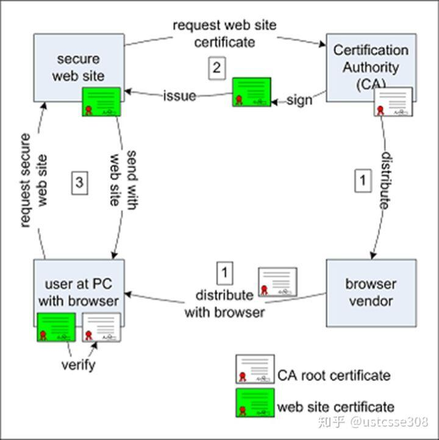

## 1、HTTPS
* HTTPS，也称为HTTP over TLS。HTTPS经由超文本传输协议（HTTP）进行通信，但利用SSL/TLS来加密数据包。HTTPS开发的主要目的，是提供对网络服务器的身份认证，保护交换数据的隐私与完整性。

## 2、SSL
* 为什么需要SSL？
  * 要明白的是，网络非常的不安全。在广播环境中，明文传输的数据极有可能被窃听.譬如在Vmware中在同一局域网中的多台虚拟机，明文传输的情况下，敏感信息譬如用户名和密码可能被泄露。
  * 在vmware中启动两台虚拟机，在其中的一台中登录一下一个使用HTTP可访问的网站，然后在另一台虚拟机中启动wireshark抓包工具，然后设置抓取HTTP数据包。
  * 注意到其中的POST包，提交登录表单一般使用POST方法，现在点开这个数据包，看一些具体的内容，可以看到其中的用户名和密码都能直接从数据包中读取出来。

* SSL主要需要解决的问题
  * 现在有线网络虽然大部分都换成了集线器，大部分的通信不会广播，但是WIFI等无线网络还是广播的。也即，如果不加密，很多敏感数据都会处于危险中。这种在网络中进行抓包窃取有用信息的行为也叫作网络嗅探（sniffing）。只要网络数据是广播的，就不可能避免被嗅探。那为了防止信息泄露，我们现在可以得到一个结论，网络数据传输需要加密。加过密之后的数据即使被抓取了，没有密钥，也获得不了信息。那接下来的问题是，怎么加密？使用什么算法加密？密钥怎么分发？
  * 钓鱼攻击,攻击者的URL与正确的URL很像，但是攻击者控制的网站。也即，我们怎么确定浏览器正在访问的网站，确实是用户真实想访问的网站？

* SSL位于TCP层之上，应用层之下，也即，SSL协议位于TCP/IP协议与各种应用层协议之间，为数据通讯提供安全支持。SSL协议可分为两层
  * SSL记录协议（SSL Record Protocol）：它建立在可靠的传输协议（如TCP）之上，为高层协议提供数据封装、压缩、加密等基本功能的支持。 
  * SSL握手协议（SSL Handshake Protocol）：它建立在SSL记录协议之上，用于在实际的数据传输开始前，通讯双方进行身份认证、协商加密算法、交换加密密钥等。

* SSL/TLS协议提供的服务主要有：
    * 认证服务器和用户（可选地），确保数据发送到正确的客户机和服务器；（认证，Authentication）
    * 加密数据以防止数据中途被窃取； (保密性，Confidentiality)
    * 维护数据的完整性，确保数据在传输过程中不被改变。 (完整性，Integrity)

## 3、SSL是怎么样提供服务
#### 3-1 前言
* 首先，肯定不可能对所有的用户都使用相同的密钥；否则就如同没有加密；
* 其次，不可能使用非对称加密的方法对流量进行加密，各种非对称加密的方法相比对称加密，都存在计算量巨大，耗CPU资源的缺点；
* 再次，对相同的用户也需要不同的会话使用不同的密钥，防止密文分析，从而被破解。
* 我们来想一下，要求每次会话不同密钥，实际上是要求在每次开始会话的时候进行密钥协商的；那有没有可能每次会话的时候，服务器告诉用户我们这次使用这个密钥？这是不行的，因为在没有密钥之前，它们的通信还是明文的话，这个密钥被嗅探了，那就没用了。所以，一般来说，要求加密的密钥不要在网络上传输，一般都是通过一些参数的传递，计算出密钥。接着的问题是，即使是这些参数，传输的时候也必须是加密的。那问题就来了，**最开始用于加密的密钥是哪儿来的呢？**

#### 3-2 非对称加密
  >我们首先看一个很简单的游戏。让对方任意想一个三位数，把这个三位数乘以 91 的乘积的末三位告诉我，我便能猜出对方原来想的数是多少。如果对方心里想的数是 123 ，那么对方就计算出 123 × 91 等于 11193 ，并把结果的末三位 193 告诉我。看起来，这么做似乎损失了不少信息，让我没法反推出原来的数。不过，我仍然有办法：只需要把对方告诉我的结果再乘以 11 ，乘积的末三位就是对方刚开始想的数了。你可以验证一下， 193 × 11 = 2123 ，末三位正是对方所想的秘密数字！其实道理很简单， 91 乘以 11 等于 1001 ，而任何一个三位数乘以 1001 后，末三位显然都不变（例如 123 乘以 1001 就等于 123123 ）。先让对方在他所想的数上乘以 91 ，假设乘积为 X ；我再在 X 的基础上乘以 11 ，其结果相当于我俩合作把原数乘以了 1001 ，自然末三位又变了回去。然而， X 乘以 11 后的末三位是什么，只与 X 的末三位有关。因此，对方只需要告诉我 X 的末三位就行了，这并不会丢掉信息。

* 从密码学的角度来看这个问题，相当于是“对方”和“我”两人要交换一个信息123。但是网络是不安全的，所以“对方‘’首先用密钥91*123，然后将加密出来的数据193在网络上进行传输。“我”收到密文之后，使用另一个密钥11来解密。在这个系统中，加解密的密钥是不同的，就是非对称加密。

* 非对称加密还有一个特点，加解密的密钥是可以互换的。不论用哪个密钥加密，另一个密钥都可以实现解密。

#### 3-3 新的问题
* RSA算法的特点是只要密钥足够长，在当前算力的情况下，是不可破解的。也即如果使用公钥加密，只能使用私钥才能解密。那么，只要服务器将自己的公钥发出去，**任何用户都可以使用这个公钥把自己想发给服务器的信息加密**，譬如可以传一下生成加密密钥（对称密钥）的参数。服务器收到这个加密的参数信息之后，就可以使用服务器的私钥解密，然后和用户协商出来一个对称密钥，用于之后的会话加密。

>这里要强调的是，私钥一定要妥善保管。私钥一定要妥善保管。私钥一定要妥善保管。

* 那我们想一下，这个过程有没有什么问题？要知道网络上的数据传输不安全，还包括什么呢？用户如何判断**刚收到的支付宝的公钥确实是支付宝发过来的？** 极有可能有个中间人，首先截获了支付宝的公钥自己留着，然后发送自己的公钥给用户。这样，所有的流量，虽然是加密的，但是对于中间人，毫无秘密可言了。

## 4、数字签名
#### 4-1 前言
* 在浏览器的世界中，也存在一些官方机构。这些机构负责对每个需要HTTPS的网站进行认证，然后给它们发证书。发了证书之后，网站就能够自证身份了。浏览器只需要保留这些机构的信息就行了。在浏览器中有这些机构的信息，就能够验证机构发出去的证书，从而可以验证网站的身份。

* 这些机构就叫做CA。

#### 4-2 实现原理
* 过程
  * 首先第一步，类似于火车站记住了全国的各大高校，**浏览器**需要记住各大CA。浏览器是怎么样记住CA的呢？在浏览器开发的时候，各个CA就把自己的证书交给了浏览器。大家可以想一下，CA的证书中包含了什么内容？

  * 第二步，各大网站，如**支付宝**，将自己的证书交给CA。CA此时需要做的事情是，通过各种法定机构，验证网站的身份。如果CA确定该网站是真的，那么就需要给网站的证书签名。这里的问题是，如何签名？以及，网站交给CA的证书中包括什么内容？【这一步就类似于学生要求学校给自己的学生证盖章。学校可以通过检查身份证等多种方式确定该学生确实是本校学生，然后盖章。在学生证上一般包括什么信息呢？】

  * 第三步，用户使用浏览器链接到网站。在加密连接建立之前，网站（支付宝）首先将自己的经过CA签名的证书发给用户浏览器，浏览器首先根据该证书的信息，如哪个CA对它进行了签名，结合浏览器自带的CA的证书，对该签名证书进行验证，如果验证通过，那么可以确定这个网站是真是网站。【火车站具体检查，包括检查学校的印章，以及检查学生证上的照片和持证人确实是同一人。】

  * 第四步，在验证通过之后，浏览器开始和网站建立安全通信。

#### 4-3 数字签名
* 前面讲过，在非对称加密系统中，公私钥都可以用来作为加密密钥。因为公钥是公开的，只有私钥可以解密，而私钥是只有所有者自己知道的，所以，使用公钥加密，即使被人拦截，也不会存在信息泄露的风险；另一方面，如果是私钥加密，任何都可以解密，所以毫无保密性可言，但是，所有人都可以通过使用公钥解密，通过验证解密之后的信息，确定这个加密的信息确实是私钥的所有人所签发的。这就是所说的“公钥加密，私钥签名”。
* 在实际应用中，通常通过对信息做摘要，然后对摘要进行**私钥签名**。然后将消息原文和签名的摘要一起发给接收者。接收者通过对加密的摘要解密，然后对消息使用同样的算法做摘要，比对两份摘要，如果两份信息相同，则可以确定，1. 消息的发送者；2.消息没有被篡改。
> 私钥签名后，所有公钥都可以破解，但是有啥用？破解就破解呗，我只要得到破解后的信息就好（进行比对）

#### 4-4 CA-浏览器-网站之间的信息交互
* CA交给浏览器的信息主要有哪些？
    * 毫无疑问，CA需要使用自己的私钥给网站发过来的证书进行签名；那么为了让浏览器能够验证这个签名，浏览器一定要有CA的公钥。所以，CA交给浏览器的信息最重要的就是**CA自己的公钥**
* 网站在交给CA的证书中应该包括什么信息呢？
  * 第一是证明自己确实是自己，对于浏览器而言，网站就是一个URL，所以，网站的证书里一定要有URL
  * 第二是和浏览器能够协商出会话密钥（因为浏览器将自己生成会话密钥的信息通过加密的方式传递给网站），因此还需要网站自己的公钥。
#### 4-5 交互流程图
