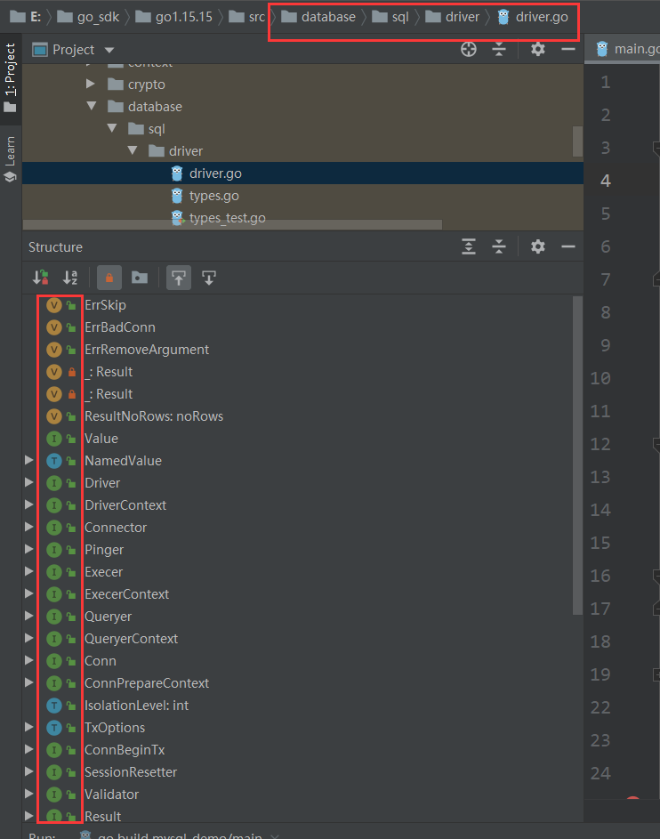

## 1、引言
* 如下代码，是go连接mysql数据库的基础框架，接下来我们来解析它到底怎么连接上mysql的
```
package main


import (
    "database/sql"
    "fmt"
    _ "github.com/go-sql-driver/mysql"
)
// 定义一个全局对象db
var db *sql.DB

// 定义一个初始化数据库的函数
func initDB() (err error) {
    // DSN:Data Source Name
    dsn := "root:123456@tcp(127.0.0.1:3306)/goStudy_mysql_demo?charset=utf8mb4  parseTime=True"   
    
    // 不会校验账号密码是否正确.由Ping来校验
    // 注意！！！这里不要使用:=，我们是给全局变量赋值，然后在main函数中使用全局变量db
    db, err = sql.Open("mysql", dsn)
    if err != nil {
        return err
    }   
    // 尝试与数据库建立连接（校验dsn是否正确）
    err = db.Ping()
    if err != nil {
        return err
    }
    return nil
}

func main() {
    err := initDB() // 调用输出化数据库的函数
    if err != nil {
    	fmt.Printf("init db failed,err:%v\n", err)
    	return
    }
    defer db.Close()
    fmt.Printf("hello mysql")
}
```
* 小细节，为什么上面代码中的defer db.Close()语句不应该写在if err != nil的前面呢？
    * 如果加了defer，那么可以放在if err != nil之前
    * 没有加的话，要确保db!= nil,才可以调用Close()
        * mysql里面的Open()什么时候会返回nil，后面有源码解析
## 2、mysql的第三方驱动
* `github.com/go-sql-driver/mysql`,注意我们只是执行里面的`init()`,来初始化，并不使用到该变量
* 实际上inti()就是将“mysql”和&MySQLDriver{}关联起来，实现注册，下一次用户调用sql.Open()时，可以找得到已经初始化过的&MySQLDriver{}
```
var (
    driversMu sync.RWMutex //读写锁，原生map无法支持并发
    drivers   = make(map[string]driver.Driver)
)

func init() {
    //源码里面写死了第一个参数为mysql
    sql.Register("mysql", &MySQLDriver{})
}

//实现注册
func Register(name string, driver driver.Driver) {
    driversMu.Lock()
    defer driversMu.Unlock()
    if driver == nil {
        panic("sql: Register driver is nil")
    }
    if _, dup := drivers[name]; dup {
        panic("sql: Register called twice for driver " + name)
    }
    drivers[name] = driver
}
```
* 那么&MySQLDriver{}是什么？，阅读源码可以发现，他是一个struct
```
// MySQLDriver is exported to make the driver directly accessible.
// In general the driver is used via the database/sql package.
type MySQLDriver struct{}
```
* MySQLDrive实现了database/sql下面的两个接口
```
type Driver interface {
    Open(name string) (Conn, error)
}

type DriverContext interface {
    OpenConnector(name string) (Connector, error)
}
```

## 3、sql.Open()
```
func Open(driverName, dataSourceName string) (*DB, error) {
    driversMu.RLock()

    //并发访问map，根据driverName拿到已经注册过的driver（也就是上一小节里面的MySQLDrive{}）
    driveri, ok := drivers[driverName]
    driversMu.RUnlock()

    //此时db=nil
    if !ok {
        return nil, fmt.Errorf("sql: unknown driver %q (forgotten import?)", driverName)
    }

    //之后db，都会初始化成!= nil,但是不可以保证已经连接成功
    //应该有Ping(),来测试，后面马上会讲到

    //错误检查
    if driverCtx, ok := driveri.(driver.DriverContext); ok {
        connector, err := driverCtx.OpenConnector(dataSourceName)
        if err != nil {
            return nil, err
        }
        return OpenDB(connector), nil
    }
    
    return OpenDB(dsnConnector{dsn: dataSourceName, driver: driveri}), nil
}

func OpenDB(c driver.Connector) *DB {
    ctx, cancel := context.WithCancel(context.Background())
    //初始化要返回的*DB
    db := &DB{
        connector:    c,
        openerCh:     make(chan struct{}, connectionRequestQueueSize),
        lastPut:      make(map[*driverConn]string),
        connRequests: make(map[uint64]chan connRequest),
        stop:         cancel,
    }   
    go db.connectionOpener(ctx) 
    return db
}
```
* 千万注意，Open()不会校验账号密码是否正确,由Ping()来校验，**is still alive？**
```
// Ping verifies a connection to the database is still alive,
// establishing a connection if necessary.
func (db *DB) Ping() error {
	return db.PingContext(context.Background())
}
```

## 4、面向接口编程
#### 4-1 database/sql包
* driver.go内容结构如下图

* 可以看到，该文件里面全是接口，没有具体的实现，说明这是等待第三方来实现(如mysql、sqlServer)

* sql.go，这个文件是提供给程序员，程序员直接调用里面的函数就行了(Open、Close等等)
  
#### 4-2 _github.com/go-sql-driver/mysql包
* 这里面就是mysql提供的具体的实现了，`database/sql`规定了什么接口，第三方就必须全部实现，这样，就算第三方更改（mysql更换成为sqlServer）了，程序员代码几乎不用改变，无非就是`sql.Open("mysql", dsn)`里面的第一个参数名字更改而已。